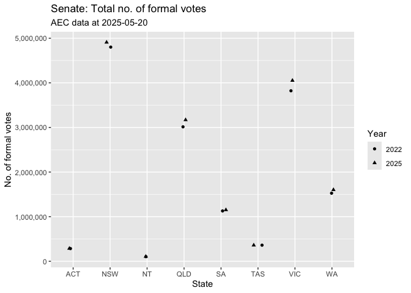

 

# House of Representatives

## Informal votes by state - 2022

<table class="table" style="color: black; width: auto !important; margin-left: auto; margin-right: auto;">
 <thead>
  <tr>
   <th style="text-align:left;"> StateAb </th>
   <th style="text-align:right;"> state_informal </th>
  </tr>
 </thead>
<tbody>
  <tr>
   <td style="text-align:left;"> ACT </td>
   <td style="text-align:right;"> 7116 </td>
  </tr>
  <tr>
   <td style="text-align:left;"> NSW </td>
   <td style="text-align:right;"> 308644 </td>
  </tr>
  <tr>
   <td style="text-align:left;"> NT </td>
   <td style="text-align:right;"> 5658 </td>
  </tr>
  <tr>
   <td style="text-align:left;"> QLD </td>
   <td style="text-align:right;"> 128732 </td>
  </tr>
  <tr>
   <td style="text-align:left;"> SA </td>
   <td style="text-align:right;"> 59222 </td>
  </tr>
  <tr>
   <td style="text-align:left;"> TAS </td>
   <td style="text-align:right;"> 21734 </td>
  </tr>
  <tr>
   <td style="text-align:left;"> VIC </td>
   <td style="text-align:right;"> 185174 </td>
  </tr>
  <tr>
   <td style="text-align:left;"> WA </td>
   <td style="text-align:right;"> 86057 </td>
  </tr>
</tbody>
</table>

 

## Informal votes by state - 2025

<table class="table" style="color: black; width: auto !important; margin-left: auto; margin-right: auto;">
 <thead>
  <tr>
   <th style="text-align:left;"> StateAb </th>
   <th style="text-align:right;"> state_informal </th>
  </tr>
 </thead>
<tbody>
  <tr>
   <td style="text-align:left;"> ACT </td>
   <td style="text-align:right;"> 7239 </td>
  </tr>
  <tr>
   <td style="text-align:left;"> NSW </td>
   <td style="text-align:right;"> 417480 </td>
  </tr>
  <tr>
   <td style="text-align:left;"> NT </td>
   <td style="text-align:right;"> 4381 </td>
  </tr>
  <tr>
   <td style="text-align:left;"> QLD </td>
   <td style="text-align:right;"> 161995 </td>
  </tr>
  <tr>
   <td style="text-align:left;"> SA </td>
   <td style="text-align:right;"> 62520 </td>
  </tr>
  <tr>
   <td style="text-align:left;"> TAS </td>
   <td style="text-align:right;"> 16204 </td>
  </tr>
  <tr>
   <td style="text-align:left;"> VIC </td>
   <td style="text-align:right;"> 177870 </td>
  </tr>
  <tr>
   <td style="text-align:left;"> WA </td>
   <td style="text-align:right;"> 65225 </td>
  </tr>
</tbody>
</table>

 

## Difference in total number of ballot papers lodged between 2022 and 2025

There were 929,220 more voters who voted for the House of 
Reps in 2025 than in 2022.

 

## Votes by state - 2022 and 2025

<table class="table" style="color: black; width: auto !important; margin-left: auto; margin-right: auto;">
 <thead>
  <tr>
   <th style="text-align:left;"> StateAb </th>
   <th style="text-align:center;"> Year </th>
   <th style="text-align:right;"> state_votes </th>
   <th style="text-align:right;"> state_informal </th>
   <th style="text-align:right;"> state_formal </th>
  </tr>
 </thead>
<tbody>
  <tr>
   <td style="text-align:left;"> ACT </td>
   <td style="text-align:center;"> 2022 </td>
   <td style="text-align:right;"> 289,113 </td>
   <td style="text-align:right;"> 7,116 </td>
   <td style="text-align:right;"> 281,997 </td>
  </tr>
  <tr>
   <td style="text-align:left;"> ACT </td>
   <td style="text-align:center;"> 2025 </td>
   <td style="text-align:right;"> 297,814 </td>
   <td style="text-align:right;"> 7,239 </td>
   <td style="text-align:right;"> 290,575 </td>
  </tr>
  <tr>
   <td style="text-align:left;background-color: rgba(238, 238, 238, 255) !important;"> NSW </td>
   <td style="text-align:center;background-color: rgba(238, 238, 238, 255) !important;"> 2022 </td>
   <td style="text-align:right;background-color: rgba(238, 238, 238, 255) !important;"> 4,959,584 </td>
   <td style="text-align:right;background-color: rgba(238, 238, 238, 255) !important;"> 308,644 </td>
   <td style="text-align:right;background-color: rgba(238, 238, 238, 255) !important;"> 4,650,940 </td>
  </tr>
  <tr>
   <td style="text-align:left;background-color: rgba(238, 238, 238, 255) !important;"> NSW </td>
   <td style="text-align:center;background-color: rgba(238, 238, 238, 255) !important;"> 2025 </td>
   <td style="text-align:right;background-color: rgba(238, 238, 238, 255) !important;"> 5,209,520 </td>
   <td style="text-align:right;background-color: rgba(238, 238, 238, 255) !important;"> 417,480 </td>
   <td style="text-align:right;background-color: rgba(238, 238, 238, 255) !important;"> 4,792,040 </td>
  </tr>
  <tr>
   <td style="text-align:left;"> NT </td>
   <td style="text-align:center;"> 2022 </td>
   <td style="text-align:right;"> 106,595 </td>
   <td style="text-align:right;"> 5,658 </td>
   <td style="text-align:right;"> 100,937 </td>
  </tr>
  <tr>
   <td style="text-align:left;"> NT </td>
   <td style="text-align:center;"> 2025 </td>
   <td style="text-align:right;"> 109,664 </td>
   <td style="text-align:right;"> 4,381 </td>
   <td style="text-align:right;"> 105,283 </td>
  </tr>
  <tr>
   <td style="text-align:left;background-color: rgba(238, 238, 238, 255) !important;"> QLD </td>
   <td style="text-align:center;background-color: rgba(238, 238, 238, 255) !important;"> 2022 </td>
   <td style="text-align:right;background-color: rgba(238, 238, 238, 255) !important;"> 3,086,758 </td>
   <td style="text-align:right;background-color: rgba(238, 238, 238, 255) !important;"> 128,732 </td>
   <td style="text-align:right;background-color: rgba(238, 238, 238, 255) !important;"> 2,958,026 </td>
  </tr>
  <tr>
   <td style="text-align:left;background-color: rgba(238, 238, 238, 255) !important;"> QLD </td>
   <td style="text-align:center;background-color: rgba(238, 238, 238, 255) !important;"> 2025 </td>
   <td style="text-align:right;background-color: rgba(238, 238, 238, 255) !important;"> 3,303,619 </td>
   <td style="text-align:right;background-color: rgba(238, 238, 238, 255) !important;"> 161,995 </td>
   <td style="text-align:right;background-color: rgba(238, 238, 238, 255) !important;"> 3,141,624 </td>
  </tr>
  <tr>
   <td style="text-align:left;"> SA </td>
   <td style="text-align:center;"> 2022 </td>
   <td style="text-align:right;"> 1,157,008 </td>
   <td style="text-align:right;"> 59,222 </td>
   <td style="text-align:right;"> 1,097,786 </td>
  </tr>
  <tr>
   <td style="text-align:left;"> SA </td>
   <td style="text-align:center;"> 2025 </td>
   <td style="text-align:right;"> 1,193,027 </td>
   <td style="text-align:right;"> 62,520 </td>
   <td style="text-align:right;"> 1,130,507 </td>
  </tr>
  <tr>
   <td style="text-align:left;background-color: rgba(238, 238, 238, 255) !important;"> TAS </td>
   <td style="text-align:center;background-color: rgba(238, 238, 238, 255) !important;"> 2022 </td>
   <td style="text-align:right;background-color: rgba(238, 238, 238, 255) !important;"> 371,432 </td>
   <td style="text-align:right;background-color: rgba(238, 238, 238, 255) !important;"> 21,734 </td>
   <td style="text-align:right;background-color: rgba(238, 238, 238, 255) !important;"> 349,698 </td>
  </tr>
  <tr>
   <td style="text-align:left;background-color: rgba(238, 238, 238, 255) !important;"> TAS </td>
   <td style="text-align:center;background-color: rgba(238, 238, 238, 255) !important;"> 2025 </td>
   <td style="text-align:right;background-color: rgba(238, 238, 238, 255) !important;"> 383,220 </td>
   <td style="text-align:right;background-color: rgba(238, 238, 238, 255) !important;"> 16,204 </td>
   <td style="text-align:right;background-color: rgba(238, 238, 238, 255) !important;"> 367,016 </td>
  </tr>
  <tr>
   <td style="text-align:left;"> VIC </td>
   <td style="text-align:center;"> 2022 </td>
   <td style="text-align:right;"> 3,931,607 </td>
   <td style="text-align:right;"> 185,174 </td>
   <td style="text-align:right;"> 3,746,433 </td>
  </tr>
  <tr>
   <td style="text-align:left;"> VIC </td>
   <td style="text-align:center;"> 2025 </td>
   <td style="text-align:right;"> 4,231,210 </td>
   <td style="text-align:right;"> 177,870 </td>
   <td style="text-align:right;"> 4,053,340 </td>
  </tr>
  <tr>
   <td style="text-align:left;background-color: rgba(238, 238, 238, 255) !important;"> WA </td>
   <td style="text-align:center;background-color: rgba(238, 238, 238, 255) !important;"> 2022 </td>
   <td style="text-align:right;background-color: rgba(238, 238, 238, 255) !important;"> 1,559,282 </td>
   <td style="text-align:right;background-color: rgba(238, 238, 238, 255) !important;"> 86,057 </td>
   <td style="text-align:right;background-color: rgba(238, 238, 238, 255) !important;"> 1,473,225 </td>
  </tr>
  <tr>
   <td style="text-align:left;background-color: rgba(238, 238, 238, 255) !important;"> WA </td>
   <td style="text-align:center;background-color: rgba(238, 238, 238, 255) !important;"> 2025 </td>
   <td style="text-align:right;background-color: rgba(238, 238, 238, 255) !important;"> 1,662,525 </td>
   <td style="text-align:right;background-color: rgba(238, 238, 238, 255) !important;"> 65,225 </td>
   <td style="text-align:right;background-color: rgba(238, 238, 238, 255) !important;"> 1,597,300 </td>
  </tr>
</tbody>
</table>
 

<!-- -->

 

## House of Reps: Percentage of first preference votes for ALP - 2022 and 2025

<table class="table" style="color: black; width: auto !important; margin-left: auto; margin-right: auto;">
 <thead>
  <tr>
   <th style="text-align:left;"> StateAb </th>
   <th style="text-align:center;"> Year </th>
   <th style="text-align:right;"> state_votes </th>
   <th style="text-align:right;"> state_informal </th>
   <th style="text-align:right;"> state_formal </th>
   <th style="text-align:right;"> alp_votes </th>
   <th style="text-align:right;"> alp_pc </th>
  </tr>
 </thead>
<tbody>
  <tr>
   <td style="text-align:left;"> ACT </td>
   <td style="text-align:center;"> 2022 </td>
   <td style="text-align:right;"> 289,113 </td>
   <td style="text-align:right;"> 7,116 </td>
   <td style="text-align:right;"> 281,997 </td>
   <td style="text-align:right;"> 126,595 </td>
   <td style="text-align:right;"> 44.9 </td>
  </tr>
  <tr>
   <td style="text-align:left;"> ACT </td>
   <td style="text-align:center;"> 2025 </td>
   <td style="text-align:right;"> 297,814 </td>
   <td style="text-align:right;"> 7,239 </td>
   <td style="text-align:right;"> 290,575 </td>
   <td style="text-align:right;"> 138,185 </td>
   <td style="text-align:right;"> 47.6 </td>
  </tr>
  <tr>
   <td style="text-align:left;background-color: rgba(238, 238, 238, 255) !important;"> NSW </td>
   <td style="text-align:center;background-color: rgba(238, 238, 238, 255) !important;"> 2022 </td>
   <td style="text-align:right;background-color: rgba(238, 238, 238, 255) !important;"> 4,959,584 </td>
   <td style="text-align:right;background-color: rgba(238, 238, 238, 255) !important;"> 308,644 </td>
   <td style="text-align:right;background-color: rgba(238, 238, 238, 255) !important;"> 4,650,940 </td>
   <td style="text-align:right;background-color: rgba(238, 238, 238, 255) !important;"> 1,552,684 </td>
   <td style="text-align:right;background-color: rgba(238, 238, 238, 255) !important;"> 33.4 </td>
  </tr>
  <tr>
   <td style="text-align:left;background-color: rgba(238, 238, 238, 255) !important;"> NSW </td>
   <td style="text-align:center;background-color: rgba(238, 238, 238, 255) !important;"> 2025 </td>
   <td style="text-align:right;background-color: rgba(238, 238, 238, 255) !important;"> 5,209,520 </td>
   <td style="text-align:right;background-color: rgba(238, 238, 238, 255) !important;"> 417,480 </td>
   <td style="text-align:right;background-color: rgba(238, 238, 238, 255) !important;"> 4,792,040 </td>
   <td style="text-align:right;background-color: rgba(238, 238, 238, 255) !important;"> 1,686,084 </td>
   <td style="text-align:right;background-color: rgba(238, 238, 238, 255) !important;"> 35.2 </td>
  </tr>
  <tr>
   <td style="text-align:left;"> NT </td>
   <td style="text-align:center;"> 2022 </td>
   <td style="text-align:right;"> 106,595 </td>
   <td style="text-align:right;"> 5,658 </td>
   <td style="text-align:right;"> 100,937 </td>
   <td style="text-align:right;"> 38,522 </td>
   <td style="text-align:right;"> 38.2 </td>
  </tr>
  <tr>
   <td style="text-align:left;"> NT </td>
   <td style="text-align:center;"> 2025 </td>
   <td style="text-align:right;"> 109,664 </td>
   <td style="text-align:right;"> 4,381 </td>
   <td style="text-align:right;"> 105,283 </td>
   <td style="text-align:right;"> 39,980 </td>
   <td style="text-align:right;"> 38.0 </td>
  </tr>
  <tr>
   <td style="text-align:left;background-color: rgba(238, 238, 238, 255) !important;"> QLD </td>
   <td style="text-align:center;background-color: rgba(238, 238, 238, 255) !important;"> 2022 </td>
   <td style="text-align:right;background-color: rgba(238, 238, 238, 255) !important;"> 3,086,758 </td>
   <td style="text-align:right;background-color: rgba(238, 238, 238, 255) !important;"> 128,732 </td>
   <td style="text-align:right;background-color: rgba(238, 238, 238, 255) !important;"> 2,958,026 </td>
   <td style="text-align:right;background-color: rgba(238, 238, 238, 255) !important;"> 811,069 </td>
   <td style="text-align:right;background-color: rgba(238, 238, 238, 255) !important;"> 27.4 </td>
  </tr>
  <tr>
   <td style="text-align:left;background-color: rgba(238, 238, 238, 255) !important;"> QLD </td>
   <td style="text-align:center;background-color: rgba(238, 238, 238, 255) !important;"> 2025 </td>
   <td style="text-align:right;background-color: rgba(238, 238, 238, 255) !important;"> 3,303,619 </td>
   <td style="text-align:right;background-color: rgba(238, 238, 238, 255) !important;"> 161,995 </td>
   <td style="text-align:right;background-color: rgba(238, 238, 238, 255) !important;"> 3,141,624 </td>
   <td style="text-align:right;background-color: rgba(238, 238, 238, 255) !important;"> 973,847 </td>
   <td style="text-align:right;background-color: rgba(238, 238, 238, 255) !important;"> 31.0 </td>
  </tr>
  <tr>
   <td style="text-align:left;"> SA </td>
   <td style="text-align:center;"> 2022 </td>
   <td style="text-align:right;"> 1,157,008 </td>
   <td style="text-align:right;"> 59,222 </td>
   <td style="text-align:right;"> 1,097,786 </td>
   <td style="text-align:right;"> 378,329 </td>
   <td style="text-align:right;"> 34.5 </td>
  </tr>
  <tr>
   <td style="text-align:left;"> SA </td>
   <td style="text-align:center;"> 2025 </td>
   <td style="text-align:right;"> 1,193,027 </td>
   <td style="text-align:right;"> 62,520 </td>
   <td style="text-align:right;"> 1,130,507 </td>
   <td style="text-align:right;"> 433,238 </td>
   <td style="text-align:right;"> 38.3 </td>
  </tr>
  <tr>
   <td style="text-align:left;background-color: rgba(238, 238, 238, 255) !important;"> TAS </td>
   <td style="text-align:center;background-color: rgba(238, 238, 238, 255) !important;"> 2022 </td>
   <td style="text-align:right;background-color: rgba(238, 238, 238, 255) !important;"> 371,432 </td>
   <td style="text-align:right;background-color: rgba(238, 238, 238, 255) !important;"> 21,734 </td>
   <td style="text-align:right;background-color: rgba(238, 238, 238, 255) !important;"> 349,698 </td>
   <td style="text-align:right;background-color: rgba(238, 238, 238, 255) !important;"> 95,322 </td>
   <td style="text-align:right;background-color: rgba(238, 238, 238, 255) !important;"> 27.3 </td>
  </tr>
  <tr>
   <td style="text-align:left;background-color: rgba(238, 238, 238, 255) !important;"> TAS </td>
   <td style="text-align:center;background-color: rgba(238, 238, 238, 255) !important;"> 2025 </td>
   <td style="text-align:right;background-color: rgba(238, 238, 238, 255) !important;"> 383,220 </td>
   <td style="text-align:right;background-color: rgba(238, 238, 238, 255) !important;"> 16,204 </td>
   <td style="text-align:right;background-color: rgba(238, 238, 238, 255) !important;"> 367,016 </td>
   <td style="text-align:right;background-color: rgba(238, 238, 238, 255) !important;"> 134,304 </td>
   <td style="text-align:right;background-color: rgba(238, 238, 238, 255) !important;"> 36.6 </td>
  </tr>
  <tr>
   <td style="text-align:left;"> VIC </td>
   <td style="text-align:center;"> 2022 </td>
   <td style="text-align:right;"> 3,931,607 </td>
   <td style="text-align:right;"> 185,174 </td>
   <td style="text-align:right;"> 3,746,433 </td>
   <td style="text-align:right;"> 1,230,842 </td>
   <td style="text-align:right;"> 32.9 </td>
  </tr>
  <tr>
   <td style="text-align:left;"> VIC </td>
   <td style="text-align:center;"> 2025 </td>
   <td style="text-align:right;"> 4,231,210 </td>
   <td style="text-align:right;"> 177,870 </td>
   <td style="text-align:right;"> 4,053,340 </td>
   <td style="text-align:right;"> 1,375,648 </td>
   <td style="text-align:right;"> 33.9 </td>
  </tr>
  <tr>
   <td style="text-align:left;background-color: rgba(238, 238, 238, 255) !important;"> WA </td>
   <td style="text-align:center;background-color: rgba(238, 238, 238, 255) !important;"> 2022 </td>
   <td style="text-align:right;background-color: rgba(238, 238, 238, 255) !important;"> 1,559,282 </td>
   <td style="text-align:right;background-color: rgba(238, 238, 238, 255) !important;"> 86,057 </td>
   <td style="text-align:right;background-color: rgba(238, 238, 238, 255) !important;"> 1,473,225 </td>
   <td style="text-align:right;background-color: rgba(238, 238, 238, 255) !important;"> 542,667 </td>
   <td style="text-align:right;background-color: rgba(238, 238, 238, 255) !important;"> 36.8 </td>
  </tr>
  <tr>
   <td style="text-align:left;background-color: rgba(238, 238, 238, 255) !important;"> WA </td>
   <td style="text-align:center;background-color: rgba(238, 238, 238, 255) !important;"> 2025 </td>
   <td style="text-align:right;background-color: rgba(238, 238, 238, 255) !important;"> 1,662,525 </td>
   <td style="text-align:right;background-color: rgba(238, 238, 238, 255) !important;"> 65,225 </td>
   <td style="text-align:right;background-color: rgba(238, 238, 238, 255) !important;"> 1,597,300 </td>
   <td style="text-align:right;background-color: rgba(238, 238, 238, 255) !important;"> 568,222 </td>
   <td style="text-align:right;background-color: rgba(238, 238, 238, 255) !important;"> 35.6 </td>
  </tr>
</tbody>
</table>

 

<!-- -->

 

 

## House of Reps: Percentage of first preference votes for the Greens - 2022 and 2025

There are three separate figures for the Greens in the AEC voting figures: Australian Greens, Qld Greens and WA Greens. 

<table class="table" style="color: black; width: auto !important; margin-left: auto; margin-right: auto;">
 <thead>
  <tr>
   <th style="text-align:left;"> StateAb </th>
   <th style="text-align:center;"> Year </th>
   <th style="text-align:right;"> state_votes </th>
   <th style="text-align:right;"> state_informal </th>
   <th style="text-align:right;"> state_formal </th>
   <th style="text-align:right;"> grn_votes </th>
   <th style="text-align:right;"> grn_pc </th>
  </tr>
 </thead>
<tbody>
  <tr>
   <td style="text-align:left;"> ACT </td>
   <td style="text-align:center;"> 2022 </td>
   <td style="text-align:right;"> 289,113 </td>
   <td style="text-align:right;"> 7,116 </td>
   <td style="text-align:right;"> 281,997 </td>
   <td style="text-align:right;"> 52,648 </td>
   <td style="text-align:right;"> 18.7 </td>
  </tr>
  <tr>
   <td style="text-align:left;"> ACT </td>
   <td style="text-align:center;"> 2025 </td>
   <td style="text-align:right;"> 297,814 </td>
   <td style="text-align:right;"> 7,239 </td>
   <td style="text-align:right;"> 290,575 </td>
   <td style="text-align:right;"> 43,709 </td>
   <td style="text-align:right;"> 15.0 </td>
  </tr>
  <tr>
   <td style="text-align:left;background-color: rgba(238, 238, 238, 255) !important;"> NSW </td>
   <td style="text-align:center;background-color: rgba(238, 238, 238, 255) !important;"> 2022 </td>
   <td style="text-align:right;background-color: rgba(238, 238, 238, 255) !important;"> 4,959,584 </td>
   <td style="text-align:right;background-color: rgba(238, 238, 238, 255) !important;"> 308,644 </td>
   <td style="text-align:right;background-color: rgba(238, 238, 238, 255) !important;"> 4,650,940 </td>
   <td style="text-align:right;background-color: rgba(238, 238, 238, 255) !important;"> 466,069 </td>
   <td style="text-align:right;background-color: rgba(238, 238, 238, 255) !important;"> 10.0 </td>
  </tr>
  <tr>
   <td style="text-align:left;background-color: rgba(238, 238, 238, 255) !important;"> NSW </td>
   <td style="text-align:center;background-color: rgba(238, 238, 238, 255) !important;"> 2025 </td>
   <td style="text-align:right;background-color: rgba(238, 238, 238, 255) !important;"> 5,209,520 </td>
   <td style="text-align:right;background-color: rgba(238, 238, 238, 255) !important;"> 417,480 </td>
   <td style="text-align:right;background-color: rgba(238, 238, 238, 255) !important;"> 4,792,040 </td>
   <td style="text-align:right;background-color: rgba(238, 238, 238, 255) !important;"> 529,940 </td>
   <td style="text-align:right;background-color: rgba(238, 238, 238, 255) !important;"> 11.1 </td>
  </tr>
  <tr>
   <td style="text-align:left;"> NT </td>
   <td style="text-align:center;"> 2022 </td>
   <td style="text-align:right;"> 106,595 </td>
   <td style="text-align:right;"> 5,658 </td>
   <td style="text-align:right;"> 100,937 </td>
   <td style="text-align:right;"> 13,182 </td>
   <td style="text-align:right;"> 13.1 </td>
  </tr>
  <tr>
   <td style="text-align:left;"> NT </td>
   <td style="text-align:center;"> 2025 </td>
   <td style="text-align:right;"> 109,664 </td>
   <td style="text-align:right;"> 4,381 </td>
   <td style="text-align:right;"> 105,283 </td>
   <td style="text-align:right;"> 10,718 </td>
   <td style="text-align:right;"> 10.2 </td>
  </tr>
  <tr>
   <td style="text-align:left;background-color: rgba(238, 238, 238, 255) !important;"> QLD </td>
   <td style="text-align:center;background-color: rgba(238, 238, 238, 255) !important;"> 2022 </td>
   <td style="text-align:right;background-color: rgba(238, 238, 238, 255) !important;"> 3,086,758 </td>
   <td style="text-align:right;background-color: rgba(238, 238, 238, 255) !important;"> 128,732 </td>
   <td style="text-align:right;background-color: rgba(238, 238, 238, 255) !important;"> 2,958,026 </td>
   <td style="text-align:right;background-color: rgba(238, 238, 238, 255) !important;"> 382,900 </td>
   <td style="text-align:right;background-color: rgba(238, 238, 238, 255) !important;"> 12.9 </td>
  </tr>
  <tr>
   <td style="text-align:left;background-color: rgba(238, 238, 238, 255) !important;"> QLD </td>
   <td style="text-align:center;background-color: rgba(238, 238, 238, 255) !important;"> 2025 </td>
   <td style="text-align:right;background-color: rgba(238, 238, 238, 255) !important;"> 3,303,619 </td>
   <td style="text-align:right;background-color: rgba(238, 238, 238, 255) !important;"> 161,995 </td>
   <td style="text-align:right;background-color: rgba(238, 238, 238, 255) !important;"> 3,141,624 </td>
   <td style="text-align:right;background-color: rgba(238, 238, 238, 255) !important;"> 369,373 </td>
   <td style="text-align:right;background-color: rgba(238, 238, 238, 255) !important;"> 11.8 </td>
  </tr>
  <tr>
   <td style="text-align:left;"> SA </td>
   <td style="text-align:center;"> 2022 </td>
   <td style="text-align:right;"> 1,157,008 </td>
   <td style="text-align:right;"> 59,222 </td>
   <td style="text-align:right;"> 1,097,786 </td>
   <td style="text-align:right;"> 140,227 </td>
   <td style="text-align:right;"> 12.8 </td>
  </tr>
  <tr>
   <td style="text-align:left;"> SA </td>
   <td style="text-align:center;"> 2025 </td>
   <td style="text-align:right;"> 1,193,027 </td>
   <td style="text-align:right;"> 62,520 </td>
   <td style="text-align:right;"> 1,130,507 </td>
   <td style="text-align:right;"> 151,615 </td>
   <td style="text-align:right;"> 13.4 </td>
  </tr>
  <tr>
   <td style="text-align:left;background-color: rgba(238, 238, 238, 255) !important;"> TAS </td>
   <td style="text-align:center;background-color: rgba(238, 238, 238, 255) !important;"> 2022 </td>
   <td style="text-align:right;background-color: rgba(238, 238, 238, 255) !important;"> 371,432 </td>
   <td style="text-align:right;background-color: rgba(238, 238, 238, 255) !important;"> 21,734 </td>
   <td style="text-align:right;background-color: rgba(238, 238, 238, 255) !important;"> 349,698 </td>
   <td style="text-align:right;background-color: rgba(238, 238, 238, 255) !important;"> 41,972 </td>
   <td style="text-align:right;background-color: rgba(238, 238, 238, 255) !important;"> 12.0 </td>
  </tr>
  <tr>
   <td style="text-align:left;background-color: rgba(238, 238, 238, 255) !important;"> TAS </td>
   <td style="text-align:center;background-color: rgba(238, 238, 238, 255) !important;"> 2025 </td>
   <td style="text-align:right;background-color: rgba(238, 238, 238, 255) !important;"> 383,220 </td>
   <td style="text-align:right;background-color: rgba(238, 238, 238, 255) !important;"> 16,204 </td>
   <td style="text-align:right;background-color: rgba(238, 238, 238, 255) !important;"> 367,016 </td>
   <td style="text-align:right;background-color: rgba(238, 238, 238, 255) !important;"> 40,788 </td>
   <td style="text-align:right;background-color: rgba(238, 238, 238, 255) !important;"> 11.1 </td>
  </tr>
  <tr>
   <td style="text-align:left;"> VIC </td>
   <td style="text-align:center;"> 2022 </td>
   <td style="text-align:right;"> 3,931,607 </td>
   <td style="text-align:right;"> 185,174 </td>
   <td style="text-align:right;"> 3,746,433 </td>
   <td style="text-align:right;"> 514,893 </td>
   <td style="text-align:right;"> 13.7 </td>
  </tr>
  <tr>
   <td style="text-align:left;"> VIC </td>
   <td style="text-align:center;"> 2025 </td>
   <td style="text-align:right;"> 4,231,210 </td>
   <td style="text-align:right;"> 177,870 </td>
   <td style="text-align:right;"> 4,053,340 </td>
   <td style="text-align:right;"> 550,541 </td>
   <td style="text-align:right;"> 13.6 </td>
  </tr>
  <tr>
   <td style="text-align:left;background-color: rgba(238, 238, 238, 255) !important;"> WA </td>
   <td style="text-align:center;background-color: rgba(238, 238, 238, 255) !important;"> 2022 </td>
   <td style="text-align:right;background-color: rgba(238, 238, 238, 255) !important;"> 1,559,282 </td>
   <td style="text-align:right;background-color: rgba(238, 238, 238, 255) !important;"> 86,057 </td>
   <td style="text-align:right;background-color: rgba(238, 238, 238, 255) !important;"> 1,473,225 </td>
   <td style="text-align:right;background-color: rgba(238, 238, 238, 255) !important;"> 184,094 </td>
   <td style="text-align:right;background-color: rgba(238, 238, 238, 255) !important;"> 12.5 </td>
  </tr>
  <tr>
   <td style="text-align:left;background-color: rgba(238, 238, 238, 255) !important;"> WA </td>
   <td style="text-align:center;background-color: rgba(238, 238, 238, 255) !important;"> 2025 </td>
   <td style="text-align:right;background-color: rgba(238, 238, 238, 255) !important;"> 1,662,525 </td>
   <td style="text-align:right;background-color: rgba(238, 238, 238, 255) !important;"> 65,225 </td>
   <td style="text-align:right;background-color: rgba(238, 238, 238, 255) !important;"> 1,597,300 </td>
   <td style="text-align:right;background-color: rgba(238, 238, 238, 255) !important;"> 191,211 </td>
   <td style="text-align:right;background-color: rgba(238, 238, 238, 255) !important;"> 12.0 </td>
  </tr>
</tbody>
</table>

 

<!-- -->

 

## House of Reps NSW: Greens votes in 2022 and 2025

<table class="table" style="color: black; width: auto !important; margin-left: auto; margin-right: auto;">
 <thead>
  <tr>
   <th style="text-align:left;"> StateAb </th>
   <th style="text-align:center;"> Year </th>
   <th style="text-align:center;"> PartyAb </th>
   <th style="text-align:left;"> DivisionNm </th>
   <th style="text-align:right;"> TotalVotesGRN </th>
   <th style="text-align:right;"> TotalVotesDIV </th>
   <th style="text-align:right;"> grn_pc </th>
  </tr>
 </thead>
<tbody>
  <tr>
   <td style="text-align:left;"> NSW </td>
   <td style="text-align:center;"> 2022 </td>
   <td style="text-align:center;"> GRN </td>
   <td style="text-align:left;"> Banks </td>
   <td style="text-align:right;"> 8,063 </td>
   <td style="text-align:right;"> 92,045 </td>
   <td style="text-align:right;"> 8.8 </td>
  </tr>
  <tr>
   <td style="text-align:left;"> NSW </td>
   <td style="text-align:center;"> 2025 </td>
   <td style="text-align:center;"> GRN </td>
   <td style="text-align:left;"> Banks </td>
   <td style="text-align:right;"> 11,760 </td>
   <td style="text-align:right;"> 98,980 </td>
   <td style="text-align:right;"> 11.9 </td>
  </tr>
  <tr>
   <td style="text-align:left;background-color: rgba(238, 238, 238, 255) !important;"> NSW </td>
   <td style="text-align:center;background-color: rgba(238, 238, 238, 255) !important;"> 2022 </td>
   <td style="text-align:center;background-color: rgba(238, 238, 238, 255) !important;"> GRN </td>
   <td style="text-align:left;background-color: rgba(238, 238, 238, 255) !important;"> Barton </td>
   <td style="text-align:right;background-color: rgba(238, 238, 238, 255) !important;"> 11,441 </td>
   <td style="text-align:right;background-color: rgba(238, 238, 238, 255) !important;"> 91,623 </td>
   <td style="text-align:right;background-color: rgba(238, 238, 238, 255) !important;"> 12.5 </td>
  </tr>
  <tr>
   <td style="text-align:left;background-color: rgba(238, 238, 238, 255) !important;"> NSW </td>
   <td style="text-align:center;background-color: rgba(238, 238, 238, 255) !important;"> 2025 </td>
   <td style="text-align:center;background-color: rgba(238, 238, 238, 255) !important;"> GRN </td>
   <td style="text-align:left;background-color: rgba(238, 238, 238, 255) !important;"> Barton </td>
   <td style="text-align:right;background-color: rgba(238, 238, 238, 255) !important;"> 15,901 </td>
   <td style="text-align:right;background-color: rgba(238, 238, 238, 255) !important;"> 100,010 </td>
   <td style="text-align:right;background-color: rgba(238, 238, 238, 255) !important;"> 15.9 </td>
  </tr>
  <tr>
   <td style="text-align:left;"> NSW </td>
   <td style="text-align:center;"> 2022 </td>
   <td style="text-align:center;"> GRN </td>
   <td style="text-align:left;"> Bennelong </td>
   <td style="text-align:right;"> 11,395 </td>
   <td style="text-align:right;"> 99,648 </td>
   <td style="text-align:right;"> 11.4 </td>
  </tr>
  <tr>
   <td style="text-align:left;"> NSW </td>
   <td style="text-align:center;"> 2025 </td>
   <td style="text-align:center;"> GRN </td>
   <td style="text-align:left;"> Bennelong </td>
   <td style="text-align:right;"> 12,869 </td>
   <td style="text-align:right;"> 109,492 </td>
   <td style="text-align:right;"> 11.8 </td>
  </tr>
  <tr>
   <td style="text-align:left;background-color: rgba(238, 238, 238, 255) !important;"> NSW </td>
   <td style="text-align:center;background-color: rgba(238, 238, 238, 255) !important;"> 2022 </td>
   <td style="text-align:center;background-color: rgba(238, 238, 238, 255) !important;"> GRN </td>
   <td style="text-align:left;background-color: rgba(238, 238, 238, 255) !important;"> Berowra </td>
   <td style="text-align:right;background-color: rgba(238, 238, 238, 255) !important;"> 14,536 </td>
   <td style="text-align:right;background-color: rgba(238, 238, 238, 255) !important;"> 93,306 </td>
   <td style="text-align:right;background-color: rgba(238, 238, 238, 255) !important;"> 15.6 </td>
  </tr>
  <tr>
   <td style="text-align:left;background-color: rgba(238, 238, 238, 255) !important;"> NSW </td>
   <td style="text-align:center;background-color: rgba(238, 238, 238, 255) !important;"> 2025 </td>
   <td style="text-align:center;background-color: rgba(238, 238, 238, 255) !important;"> GRN </td>
   <td style="text-align:left;background-color: rgba(238, 238, 238, 255) !important;"> Berowra </td>
   <td style="text-align:right;background-color: rgba(238, 238, 238, 255) !important;"> 13,788 </td>
   <td style="text-align:right;background-color: rgba(238, 238, 238, 255) !important;"> 115,589 </td>
   <td style="text-align:right;background-color: rgba(238, 238, 238, 255) !important;"> 11.9 </td>
  </tr>
  <tr>
   <td style="text-align:left;"> NSW </td>
   <td style="text-align:center;"> 2022 </td>
   <td style="text-align:center;"> GRN </td>
   <td style="text-align:left;"> Blaxland </td>
   <td style="text-align:right;"> 5,187 </td>
   <td style="text-align:right;"> 81,677 </td>
   <td style="text-align:right;"> 6.4 </td>
  </tr>
  <tr>
   <td style="text-align:left;"> NSW </td>
   <td style="text-align:center;"> 2025 </td>
   <td style="text-align:center;"> GRN </td>
   <td style="text-align:left;"> Blaxland </td>
   <td style="text-align:right;"> 6,855 </td>
   <td style="text-align:right;"> 86,917 </td>
   <td style="text-align:right;"> 7.9 </td>
  </tr>
  <tr>
   <td style="text-align:left;background-color: rgba(238, 238, 238, 255) !important;"> NSW </td>
   <td style="text-align:center;background-color: rgba(238, 238, 238, 255) !important;"> 2022 </td>
   <td style="text-align:center;background-color: rgba(238, 238, 238, 255) !important;"> GRN </td>
   <td style="text-align:left;background-color: rgba(238, 238, 238, 255) !important;"> Bradfield </td>
   <td style="text-align:right;background-color: rgba(238, 238, 238, 255) !important;"> 8,960 </td>
   <td style="text-align:right;background-color: rgba(238, 238, 238, 255) !important;"> 96,704 </td>
   <td style="text-align:right;background-color: rgba(238, 238, 238, 255) !important;"> 9.3 </td>
  </tr>
  <tr>
   <td style="text-align:left;background-color: rgba(238, 238, 238, 255) !important;"> NSW </td>
   <td style="text-align:center;background-color: rgba(238, 238, 238, 255) !important;"> 2025 </td>
   <td style="text-align:center;background-color: rgba(238, 238, 238, 255) !important;"> GRN </td>
   <td style="text-align:left;background-color: rgba(238, 238, 238, 255) !important;"> Bradfield </td>
   <td style="text-align:right;background-color: rgba(238, 238, 238, 255) !important;"> 7,573 </td>
   <td style="text-align:right;background-color: rgba(238, 238, 238, 255) !important;"> 112,420 </td>
   <td style="text-align:right;background-color: rgba(238, 238, 238, 255) !important;"> 6.7 </td>
  </tr>
  <tr>
   <td style="text-align:left;"> NSW </td>
   <td style="text-align:center;"> 2022 </td>
   <td style="text-align:center;"> GRN </td>
   <td style="text-align:left;"> Calare </td>
   <td style="text-align:right;"> 4,891 </td>
   <td style="text-align:right;"> 107,319 </td>
   <td style="text-align:right;"> 4.6 </td>
  </tr>
  <tr>
   <td style="text-align:left;"> NSW </td>
   <td style="text-align:center;"> 2025 </td>
   <td style="text-align:center;"> GRN </td>
   <td style="text-align:left;"> Calare </td>
   <td style="text-align:right;"> 3,762 </td>
   <td style="text-align:right;"> 106,341 </td>
   <td style="text-align:right;"> 3.5 </td>
  </tr>
  <tr>
   <td style="text-align:left;background-color: rgba(238, 238, 238, 255) !important;"> NSW </td>
   <td style="text-align:center;background-color: rgba(238, 238, 238, 255) !important;"> 2022 </td>
   <td style="text-align:center;background-color: rgba(238, 238, 238, 255) !important;"> GRN </td>
   <td style="text-align:left;background-color: rgba(238, 238, 238, 255) !important;"> Chifley </td>
   <td style="text-align:right;background-color: rgba(238, 238, 238, 255) !important;"> 5,622 </td>
   <td style="text-align:right;background-color: rgba(238, 238, 238, 255) !important;"> 97,189 </td>
   <td style="text-align:right;background-color: rgba(238, 238, 238, 255) !important;"> 5.8 </td>
  </tr>
  <tr>
   <td style="text-align:left;background-color: rgba(238, 238, 238, 255) !important;"> NSW </td>
   <td style="text-align:center;background-color: rgba(238, 238, 238, 255) !important;"> 2025 </td>
   <td style="text-align:center;background-color: rgba(238, 238, 238, 255) !important;"> GRN </td>
   <td style="text-align:left;background-color: rgba(238, 238, 238, 255) !important;"> Chifley </td>
   <td style="text-align:right;background-color: rgba(238, 238, 238, 255) !important;"> 8,678 </td>
   <td style="text-align:right;background-color: rgba(238, 238, 238, 255) !important;"> 89,004 </td>
   <td style="text-align:right;background-color: rgba(238, 238, 238, 255) !important;"> 9.8 </td>
  </tr>
  <tr>
   <td style="text-align:left;"> NSW </td>
   <td style="text-align:center;"> 2022 </td>
   <td style="text-align:center;"> GRN </td>
   <td style="text-align:left;"> Cook </td>
   <td style="text-align:right;"> 9,685 </td>
   <td style="text-align:right;"> 97,817 </td>
   <td style="text-align:right;"> 9.9 </td>
  </tr>
  <tr>
   <td style="text-align:left;"> NSW </td>
   <td style="text-align:center;"> 2025 </td>
   <td style="text-align:center;"> GRN </td>
   <td style="text-align:left;"> Cook </td>
   <td style="text-align:right;"> 10,577 </td>
   <td style="text-align:right;"> 106,383 </td>
   <td style="text-align:right;"> 9.9 </td>
  </tr>
  <tr>
   <td style="text-align:left;background-color: rgba(238, 238, 238, 255) !important;"> NSW </td>
   <td style="text-align:center;background-color: rgba(238, 238, 238, 255) !important;"> 2022 </td>
   <td style="text-align:center;background-color: rgba(238, 238, 238, 255) !important;"> GRN </td>
   <td style="text-align:left;background-color: rgba(238, 238, 238, 255) !important;"> Cowper </td>
   <td style="text-align:right;background-color: rgba(238, 238, 238, 255) !important;"> 6,518 </td>
   <td style="text-align:right;background-color: rgba(238, 238, 238, 255) !important;"> 111,236 </td>
   <td style="text-align:right;background-color: rgba(238, 238, 238, 255) !important;"> 5.9 </td>
  </tr>
  <tr>
   <td style="text-align:left;background-color: rgba(238, 238, 238, 255) !important;"> NSW </td>
   <td style="text-align:center;background-color: rgba(238, 238, 238, 255) !important;"> 2025 </td>
   <td style="text-align:center;background-color: rgba(238, 238, 238, 255) !important;"> GRN </td>
   <td style="text-align:left;background-color: rgba(238, 238, 238, 255) !important;"> Cowper </td>
   <td style="text-align:right;background-color: rgba(238, 238, 238, 255) !important;"> 4,568 </td>
   <td style="text-align:right;background-color: rgba(238, 238, 238, 255) !important;"> 107,762 </td>
   <td style="text-align:right;background-color: rgba(238, 238, 238, 255) !important;"> 4.2 </td>
  </tr>
  <tr>
   <td style="text-align:left;"> NSW </td>
   <td style="text-align:center;"> 2022 </td>
   <td style="text-align:center;"> GRN </td>
   <td style="text-align:left;"> Cunningham </td>
   <td style="text-align:right;"> 22,011 </td>
   <td style="text-align:right;"> 101,671 </td>
   <td style="text-align:right;"> 21.6 </td>
  </tr>
  <tr>
   <td style="text-align:left;"> NSW </td>
   <td style="text-align:center;"> 2025 </td>
   <td style="text-align:center;"> GRN </td>
   <td style="text-align:left;"> Cunningham </td>
   <td style="text-align:right;"> 23,596 </td>
   <td style="text-align:right;"> 115,504 </td>
   <td style="text-align:right;"> 20.4 </td>
  </tr>
  <tr>
   <td style="text-align:left;background-color: rgba(238, 238, 238, 255) !important;"> NSW </td>
   <td style="text-align:center;background-color: rgba(238, 238, 238, 255) !important;"> 2022 </td>
   <td style="text-align:center;background-color: rgba(238, 238, 238, 255) !important;"> GRN </td>
   <td style="text-align:left;background-color: rgba(238, 238, 238, 255) !important;"> Dobell </td>
   <td style="text-align:right;background-color: rgba(238, 238, 238, 255) !important;"> 8,700 </td>
   <td style="text-align:right;background-color: rgba(238, 238, 238, 255) !important;"> 101,717 </td>
   <td style="text-align:right;background-color: rgba(238, 238, 238, 255) !important;"> 8.6 </td>
  </tr>
  <tr>
   <td style="text-align:left;background-color: rgba(238, 238, 238, 255) !important;"> NSW </td>
   <td style="text-align:center;background-color: rgba(238, 238, 238, 255) !important;"> 2025 </td>
   <td style="text-align:center;background-color: rgba(238, 238, 238, 255) !important;"> GRN </td>
   <td style="text-align:left;background-color: rgba(238, 238, 238, 255) !important;"> Dobell </td>
   <td style="text-align:right;background-color: rgba(238, 238, 238, 255) !important;"> 10,651 </td>
   <td style="text-align:right;background-color: rgba(238, 238, 238, 255) !important;"> 103,468 </td>
   <td style="text-align:right;background-color: rgba(238, 238, 238, 255) !important;"> 10.3 </td>
  </tr>
  <tr>
   <td style="text-align:left;"> NSW </td>
   <td style="text-align:center;"> 2022 </td>
   <td style="text-align:center;"> GRN </td>
   <td style="text-align:left;"> Eden-Monaro </td>
   <td style="text-align:right;"> 9,376 </td>
   <td style="text-align:right;"> 101,517 </td>
   <td style="text-align:right;"> 9.2 </td>
  </tr>
  <tr>
   <td style="text-align:left;"> NSW </td>
   <td style="text-align:center;"> 2025 </td>
   <td style="text-align:center;"> GRN </td>
   <td style="text-align:left;"> Eden-Monaro </td>
   <td style="text-align:right;"> 10,728 </td>
   <td style="text-align:right;"> 107,065 </td>
   <td style="text-align:right;"> 10.0 </td>
  </tr>
  <tr>
   <td style="text-align:left;background-color: rgba(238, 238, 238, 255) !important;"> NSW </td>
   <td style="text-align:center;background-color: rgba(238, 238, 238, 255) !important;"> 2022 </td>
   <td style="text-align:center;background-color: rgba(238, 238, 238, 255) !important;"> GRN </td>
   <td style="text-align:left;background-color: rgba(238, 238, 238, 255) !important;"> Farrer </td>
   <td style="text-align:right;background-color: rgba(238, 238, 238, 255) !important;"> 9,163 </td>
   <td style="text-align:right;background-color: rgba(238, 238, 238, 255) !important;"> 100,582 </td>
   <td style="text-align:right;background-color: rgba(238, 238, 238, 255) !important;"> 9.1 </td>
  </tr>
  <tr>
   <td style="text-align:left;background-color: rgba(238, 238, 238, 255) !important;"> NSW </td>
   <td style="text-align:center;background-color: rgba(238, 238, 238, 255) !important;"> 2025 </td>
   <td style="text-align:center;background-color: rgba(238, 238, 238, 255) !important;"> GRN </td>
   <td style="text-align:left;background-color: rgba(238, 238, 238, 255) !important;"> Farrer </td>
   <td style="text-align:right;background-color: rgba(238, 238, 238, 255) !important;"> 5,070 </td>
   <td style="text-align:right;background-color: rgba(238, 238, 238, 255) !important;"> 102,945 </td>
   <td style="text-align:right;background-color: rgba(238, 238, 238, 255) !important;"> 4.9 </td>
  </tr>
  <tr>
   <td style="text-align:left;"> NSW </td>
   <td style="text-align:center;"> 2022 </td>
   <td style="text-align:center;"> GRN </td>
   <td style="text-align:left;"> Fowler </td>
   <td style="text-align:right;"> 4,191 </td>
   <td style="text-align:right;"> 85,903 </td>
   <td style="text-align:right;"> 4.9 </td>
  </tr>
  <tr>
   <td style="text-align:left;"> NSW </td>
   <td style="text-align:center;"> 2025 </td>
   <td style="text-align:center;"> GRN </td>
   <td style="text-align:left;"> Fowler </td>
   <td style="text-align:right;"> 6,295 </td>
   <td style="text-align:right;"> 93,011 </td>
   <td style="text-align:right;"> 6.8 </td>
  </tr>
  <tr>
   <td style="text-align:left;background-color: rgba(238, 238, 238, 255) !important;"> NSW </td>
   <td style="text-align:center;background-color: rgba(238, 238, 238, 255) !important;"> 2022 </td>
   <td style="text-align:center;background-color: rgba(238, 238, 238, 255) !important;"> GRN </td>
   <td style="text-align:left;background-color: rgba(238, 238, 238, 255) !important;"> Gilmore </td>
   <td style="text-align:right;background-color: rgba(238, 238, 238, 255) !important;"> 11,417 </td>
   <td style="text-align:right;background-color: rgba(238, 238, 238, 255) !important;"> 111,705 </td>
   <td style="text-align:right;background-color: rgba(238, 238, 238, 255) !important;"> 10.2 </td>
  </tr>
  <tr>
   <td style="text-align:left;background-color: rgba(238, 238, 238, 255) !important;"> NSW </td>
   <td style="text-align:center;background-color: rgba(238, 238, 238, 255) !important;"> 2025 </td>
   <td style="text-align:center;background-color: rgba(238, 238, 238, 255) !important;"> GRN </td>
   <td style="text-align:left;background-color: rgba(238, 238, 238, 255) !important;"> Gilmore </td>
   <td style="text-align:right;background-color: rgba(238, 238, 238, 255) !important;"> 7,931 </td>
   <td style="text-align:right;background-color: rgba(238, 238, 238, 255) !important;"> 111,084 </td>
   <td style="text-align:right;background-color: rgba(238, 238, 238, 255) !important;"> 7.1 </td>
  </tr>
  <tr>
   <td style="text-align:left;"> NSW </td>
   <td style="text-align:center;"> 2022 </td>
   <td style="text-align:center;"> GRN </td>
   <td style="text-align:left;"> Grayndler </td>
   <td style="text-align:right;"> 20,846 </td>
   <td style="text-align:right;"> 94,573 </td>
   <td style="text-align:right;"> 22.0 </td>
  </tr>
  <tr>
   <td style="text-align:left;"> NSW </td>
   <td style="text-align:center;"> 2025 </td>
   <td style="text-align:center;"> GRN </td>
   <td style="text-align:left;"> Grayndler </td>
   <td style="text-align:right;"> 27,785 </td>
   <td style="text-align:right;"> 110,820 </td>
   <td style="text-align:right;"> 25.1 </td>
  </tr>
  <tr>
   <td style="text-align:left;background-color: rgba(238, 238, 238, 255) !important;"> NSW </td>
   <td style="text-align:center;background-color: rgba(238, 238, 238, 255) !important;"> 2022 </td>
   <td style="text-align:center;background-color: rgba(238, 238, 238, 255) !important;"> GRN </td>
   <td style="text-align:left;background-color: rgba(238, 238, 238, 255) !important;"> Greenway </td>
   <td style="text-align:right;background-color: rgba(238, 238, 238, 255) !important;"> 7,086 </td>
   <td style="text-align:right;background-color: rgba(238, 238, 238, 255) !important;"> 100,539 </td>
   <td style="text-align:right;background-color: rgba(238, 238, 238, 255) !important;"> 7.0 </td>
  </tr>
  <tr>
   <td style="text-align:left;background-color: rgba(238, 238, 238, 255) !important;"> NSW </td>
   <td style="text-align:center;background-color: rgba(238, 238, 238, 255) !important;"> 2025 </td>
   <td style="text-align:center;background-color: rgba(238, 238, 238, 255) !important;"> GRN </td>
   <td style="text-align:left;background-color: rgba(238, 238, 238, 255) !important;"> Greenway </td>
   <td style="text-align:right;background-color: rgba(238, 238, 238, 255) !important;"> 10,948 </td>
   <td style="text-align:right;background-color: rgba(238, 238, 238, 255) !important;"> 102,212 </td>
   <td style="text-align:right;background-color: rgba(238, 238, 238, 255) !important;"> 10.7 </td>
  </tr>
  <tr>
   <td style="text-align:left;"> NSW </td>
   <td style="text-align:center;"> 2022 </td>
   <td style="text-align:center;"> GRN </td>
   <td style="text-align:left;"> Hughes </td>
   <td style="text-align:right;"> 6,118 </td>
   <td style="text-align:right;"> 96,909 </td>
   <td style="text-align:right;"> 6.3 </td>
  </tr>
  <tr>
   <td style="text-align:left;"> NSW </td>
   <td style="text-align:center;"> 2025 </td>
   <td style="text-align:center;"> GRN </td>
   <td style="text-align:left;"> Hughes </td>
   <td style="text-align:right;"> 11,229 </td>
   <td style="text-align:right;"> 98,369 </td>
   <td style="text-align:right;"> 11.4 </td>
  </tr>
  <tr>
   <td style="text-align:left;background-color: rgba(238, 238, 238, 255) !important;"> NSW </td>
   <td style="text-align:center;background-color: rgba(238, 238, 238, 255) !important;"> 2022 </td>
   <td style="text-align:center;background-color: rgba(238, 238, 238, 255) !important;"> GRN </td>
   <td style="text-align:left;background-color: rgba(238, 238, 238, 255) !important;"> Hume </td>
   <td style="text-align:right;background-color: rgba(238, 238, 238, 255) !important;"> 5,194 </td>
   <td style="text-align:right;background-color: rgba(238, 238, 238, 255) !important;"> 104,762 </td>
   <td style="text-align:right;background-color: rgba(238, 238, 238, 255) !important;"> 5.0 </td>
  </tr>
  <tr>
   <td style="text-align:left;background-color: rgba(238, 238, 238, 255) !important;"> NSW </td>
   <td style="text-align:center;background-color: rgba(238, 238, 238, 255) !important;"> 2025 </td>
   <td style="text-align:center;background-color: rgba(238, 238, 238, 255) !important;"> GRN </td>
   <td style="text-align:left;background-color: rgba(238, 238, 238, 255) !important;"> Hume </td>
   <td style="text-align:right;background-color: rgba(238, 238, 238, 255) !important;"> 8,451 </td>
   <td style="text-align:right;background-color: rgba(238, 238, 238, 255) !important;"> 99,478 </td>
   <td style="text-align:right;background-color: rgba(238, 238, 238, 255) !important;"> 8.5 </td>
  </tr>
  <tr>
   <td style="text-align:left;"> NSW </td>
   <td style="text-align:center;"> 2022 </td>
   <td style="text-align:center;"> GRN </td>
   <td style="text-align:left;"> Hunter </td>
   <td style="text-align:right;"> 9,562 </td>
   <td style="text-align:right;"> 107,727 </td>
   <td style="text-align:right;"> 8.9 </td>
  </tr>
  <tr>
   <td style="text-align:left;"> NSW </td>
   <td style="text-align:center;"> 2025 </td>
   <td style="text-align:center;"> GRN </td>
   <td style="text-align:left;"> Hunter </td>
   <td style="text-align:right;"> 8,293 </td>
   <td style="text-align:right;"> 111,711 </td>
   <td style="text-align:right;"> 7.4 </td>
  </tr>
  <tr>
   <td style="text-align:left;background-color: rgba(238, 238, 238, 255) !important;"> NSW </td>
   <td style="text-align:center;background-color: rgba(238, 238, 238, 255) !important;"> 2022 </td>
   <td style="text-align:center;background-color: rgba(238, 238, 238, 255) !important;"> GRN </td>
   <td style="text-align:left;background-color: rgba(238, 238, 238, 255) !important;"> Kingsford Smith </td>
   <td style="text-align:right;background-color: rgba(238, 238, 238, 255) !important;"> 16,401 </td>
   <td style="text-align:right;background-color: rgba(238, 238, 238, 255) !important;"> 97,466 </td>
   <td style="text-align:right;background-color: rgba(238, 238, 238, 255) !important;"> 16.8 </td>
  </tr>
  <tr>
   <td style="text-align:left;background-color: rgba(238, 238, 238, 255) !important;"> NSW </td>
   <td style="text-align:center;background-color: rgba(238, 238, 238, 255) !important;"> 2025 </td>
   <td style="text-align:center;background-color: rgba(238, 238, 238, 255) !important;"> GRN </td>
   <td style="text-align:left;background-color: rgba(238, 238, 238, 255) !important;"> Kingsford Smith </td>
   <td style="text-align:right;background-color: rgba(238, 238, 238, 255) !important;"> 13,433 </td>
   <td style="text-align:right;background-color: rgba(238, 238, 238, 255) !important;"> 99,152 </td>
   <td style="text-align:right;background-color: rgba(238, 238, 238, 255) !important;"> 13.5 </td>
  </tr>
  <tr>
   <td style="text-align:left;"> NSW </td>
   <td style="text-align:center;"> 2022 </td>
   <td style="text-align:center;"> GRN </td>
   <td style="text-align:left;"> Lindsay </td>
   <td style="text-align:right;"> 8,404 </td>
   <td style="text-align:right;"> 104,726 </td>
   <td style="text-align:right;"> 8.0 </td>
  </tr>
  <tr>
   <td style="text-align:left;"> NSW </td>
   <td style="text-align:center;"> 2025 </td>
   <td style="text-align:center;"> GRN </td>
   <td style="text-align:left;"> Lindsay </td>
   <td style="text-align:right;"> 9,344 </td>
   <td style="text-align:right;"> 97,582 </td>
   <td style="text-align:right;"> 9.6 </td>
  </tr>
  <tr>
   <td style="text-align:left;background-color: rgba(238, 238, 238, 255) !important;"> NSW </td>
   <td style="text-align:center;background-color: rgba(238, 238, 238, 255) !important;"> 2022 </td>
   <td style="text-align:center;background-color: rgba(238, 238, 238, 255) !important;"> GRN </td>
   <td style="text-align:left;background-color: rgba(238, 238, 238, 255) !important;"> Lyne </td>
   <td style="text-align:right;background-color: rgba(238, 238, 238, 255) !important;"> 8,422 </td>
   <td style="text-align:right;background-color: rgba(238, 238, 238, 255) !important;"> 107,248 </td>
   <td style="text-align:right;background-color: rgba(238, 238, 238, 255) !important;"> 7.9 </td>
  </tr>
  <tr>
   <td style="text-align:left;background-color: rgba(238, 238, 238, 255) !important;"> NSW </td>
   <td style="text-align:center;background-color: rgba(238, 238, 238, 255) !important;"> 2025 </td>
   <td style="text-align:center;background-color: rgba(238, 238, 238, 255) !important;"> GRN </td>
   <td style="text-align:left;background-color: rgba(238, 238, 238, 255) !important;"> Lyne </td>
   <td style="text-align:right;background-color: rgba(238, 238, 238, 255) !important;"> 6,972 </td>
   <td style="text-align:right;background-color: rgba(238, 238, 238, 255) !important;"> 109,387 </td>
   <td style="text-align:right;background-color: rgba(238, 238, 238, 255) !important;"> 6.4 </td>
  </tr>
  <tr>
   <td style="text-align:left;"> NSW </td>
   <td style="text-align:center;"> 2022 </td>
   <td style="text-align:center;"> GRN </td>
   <td style="text-align:left;"> Macarthur </td>
   <td style="text-align:right;"> 8,584 </td>
   <td style="text-align:right;"> 111,127 </td>
   <td style="text-align:right;"> 7.7 </td>
  </tr>
  <tr>
   <td style="text-align:left;"> NSW </td>
   <td style="text-align:center;"> 2025 </td>
   <td style="text-align:center;"> GRN </td>
   <td style="text-align:left;"> Macarthur </td>
   <td style="text-align:right;"> 12,001 </td>
   <td style="text-align:right;"> 93,822 </td>
   <td style="text-align:right;"> 12.8 </td>
  </tr>
  <tr>
   <td style="text-align:left;background-color: rgba(238, 238, 238, 255) !important;"> NSW </td>
   <td style="text-align:center;background-color: rgba(238, 238, 238, 255) !important;"> 2022 </td>
   <td style="text-align:center;background-color: rgba(238, 238, 238, 255) !important;"> GRN </td>
   <td style="text-align:left;background-color: rgba(238, 238, 238, 255) !important;"> Mackellar </td>
   <td style="text-align:right;background-color: rgba(238, 238, 238, 255) !important;"> 6,032 </td>
   <td style="text-align:right;background-color: rgba(238, 238, 238, 255) !important;"> 98,991 </td>
   <td style="text-align:right;background-color: rgba(238, 238, 238, 255) !important;"> 6.1 </td>
  </tr>
  <tr>
   <td style="text-align:left;background-color: rgba(238, 238, 238, 255) !important;"> NSW </td>
   <td style="text-align:center;background-color: rgba(238, 238, 238, 255) !important;"> 2025 </td>
   <td style="text-align:center;background-color: rgba(238, 238, 238, 255) !important;"> GRN </td>
   <td style="text-align:left;background-color: rgba(238, 238, 238, 255) !important;"> Mackellar </td>
   <td style="text-align:right;background-color: rgba(238, 238, 238, 255) !important;"> 6,849 </td>
   <td style="text-align:right;background-color: rgba(238, 238, 238, 255) !important;"> 111,737 </td>
   <td style="text-align:right;background-color: rgba(238, 238, 238, 255) !important;"> 6.1 </td>
  </tr>
  <tr>
   <td style="text-align:left;"> NSW </td>
   <td style="text-align:center;"> 2022 </td>
   <td style="text-align:center;"> GRN </td>
   <td style="text-align:left;"> Macquarie </td>
   <td style="text-align:right;"> 9,115 </td>
   <td style="text-align:right;"> 95,452 </td>
   <td style="text-align:right;"> 9.5 </td>
  </tr>
  <tr>
   <td style="text-align:left;"> NSW </td>
   <td style="text-align:center;"> 2025 </td>
   <td style="text-align:center;"> GRN </td>
   <td style="text-align:left;"> Macquarie </td>
   <td style="text-align:right;"> 13,620 </td>
   <td style="text-align:right;"> 109,515 </td>
   <td style="text-align:right;"> 12.4 </td>
  </tr>
  <tr>
   <td style="text-align:left;background-color: rgba(238, 238, 238, 255) !important;"> NSW </td>
   <td style="text-align:center;background-color: rgba(238, 238, 238, 255) !important;"> 2022 </td>
   <td style="text-align:center;background-color: rgba(238, 238, 238, 255) !important;"> GRN </td>
   <td style="text-align:left;background-color: rgba(238, 238, 238, 255) !important;"> McMahon </td>
   <td style="text-align:right;background-color: rgba(238, 238, 238, 255) !important;"> 4,922 </td>
   <td style="text-align:right;background-color: rgba(238, 238, 238, 255) !important;"> 84,742 </td>
   <td style="text-align:right;background-color: rgba(238, 238, 238, 255) !important;"> 5.8 </td>
  </tr>
  <tr>
   <td style="text-align:left;background-color: rgba(238, 238, 238, 255) !important;"> NSW </td>
   <td style="text-align:center;background-color: rgba(238, 238, 238, 255) !important;"> 2025 </td>
   <td style="text-align:center;background-color: rgba(238, 238, 238, 255) !important;"> GRN </td>
   <td style="text-align:left;background-color: rgba(238, 238, 238, 255) !important;"> McMahon </td>
   <td style="text-align:right;background-color: rgba(238, 238, 238, 255) !important;"> 8,950 </td>
   <td style="text-align:right;background-color: rgba(238, 238, 238, 255) !important;"> 97,848 </td>
   <td style="text-align:right;background-color: rgba(238, 238, 238, 255) !important;"> 9.1 </td>
  </tr>
  <tr>
   <td style="text-align:left;"> NSW </td>
   <td style="text-align:center;"> 2022 </td>
   <td style="text-align:center;"> GRN </td>
   <td style="text-align:left;"> Mitchell </td>
   <td style="text-align:right;"> 12,796 </td>
   <td style="text-align:right;"> 108,193 </td>
   <td style="text-align:right;"> 11.8 </td>
  </tr>
  <tr>
   <td style="text-align:left;"> NSW </td>
   <td style="text-align:center;"> 2025 </td>
   <td style="text-align:center;"> GRN </td>
   <td style="text-align:left;"> Mitchell </td>
   <td style="text-align:right;"> 15,044 </td>
   <td style="text-align:right;"> 109,551 </td>
   <td style="text-align:right;"> 13.7 </td>
  </tr>
  <tr>
   <td style="text-align:left;background-color: rgba(238, 238, 238, 255) !important;"> NSW </td>
   <td style="text-align:center;background-color: rgba(238, 238, 238, 255) !important;"> 2022 </td>
   <td style="text-align:center;background-color: rgba(238, 238, 238, 255) !important;"> GRN </td>
   <td style="text-align:left;background-color: rgba(238, 238, 238, 255) !important;"> New England </td>
   <td style="text-align:right;background-color: rgba(238, 238, 238, 255) !important;"> 7,524 </td>
   <td style="text-align:right;background-color: rgba(238, 238, 238, 255) !important;"> 97,272 </td>
   <td style="text-align:right;background-color: rgba(238, 238, 238, 255) !important;"> 7.7 </td>
  </tr>
  <tr>
   <td style="text-align:left;background-color: rgba(238, 238, 238, 255) !important;"> NSW </td>
   <td style="text-align:center;background-color: rgba(238, 238, 238, 255) !important;"> 2025 </td>
   <td style="text-align:center;background-color: rgba(238, 238, 238, 255) !important;"> GRN </td>
   <td style="text-align:left;background-color: rgba(238, 238, 238, 255) !important;"> New England </td>
   <td style="text-align:right;background-color: rgba(238, 238, 238, 255) !important;"> 9,022 </td>
   <td style="text-align:right;background-color: rgba(238, 238, 238, 255) !important;"> 114,367 </td>
   <td style="text-align:right;background-color: rgba(238, 238, 238, 255) !important;"> 7.9 </td>
  </tr>
  <tr>
   <td style="text-align:left;"> NSW </td>
   <td style="text-align:center;"> 2022 </td>
   <td style="text-align:center;"> GRN </td>
   <td style="text-align:left;"> Newcastle </td>
   <td style="text-align:right;"> 21,195 </td>
   <td style="text-align:right;"> 105,627 </td>
   <td style="text-align:right;"> 20.1 </td>
  </tr>
  <tr>
   <td style="text-align:left;"> NSW </td>
   <td style="text-align:center;"> 2025 </td>
   <td style="text-align:center;"> GRN </td>
   <td style="text-align:left;"> Newcastle </td>
   <td style="text-align:right;"> 24,013 </td>
   <td style="text-align:right;"> 108,291 </td>
   <td style="text-align:right;"> 22.2 </td>
  </tr>
  <tr>
   <td style="text-align:left;background-color: rgba(238, 238, 238, 255) !important;"> NSW </td>
   <td style="text-align:center;background-color: rgba(238, 238, 238, 255) !important;"> 2022 </td>
   <td style="text-align:center;background-color: rgba(238, 238, 238, 255) !important;"> GRN </td>
   <td style="text-align:left;background-color: rgba(238, 238, 238, 255) !important;"> Page </td>
   <td style="text-align:right;background-color: rgba(238, 238, 238, 255) !important;"> 8,863 </td>
   <td style="text-align:right;background-color: rgba(238, 238, 238, 255) !important;"> 104,569 </td>
   <td style="text-align:right;background-color: rgba(238, 238, 238, 255) !important;"> 8.5 </td>
  </tr>
  <tr>
   <td style="text-align:left;background-color: rgba(238, 238, 238, 255) !important;"> NSW </td>
   <td style="text-align:center;background-color: rgba(238, 238, 238, 255) !important;"> 2025 </td>
   <td style="text-align:center;background-color: rgba(238, 238, 238, 255) !important;"> GRN </td>
   <td style="text-align:left;background-color: rgba(238, 238, 238, 255) !important;"> Page </td>
   <td style="text-align:right;background-color: rgba(238, 238, 238, 255) !important;"> 16,297 </td>
   <td style="text-align:right;background-color: rgba(238, 238, 238, 255) !important;"> 107,673 </td>
   <td style="text-align:right;background-color: rgba(238, 238, 238, 255) !important;"> 15.1 </td>
  </tr>
  <tr>
   <td style="text-align:left;"> NSW </td>
   <td style="text-align:center;"> 2022 </td>
   <td style="text-align:center;"> GRN </td>
   <td style="text-align:left;"> Parkes </td>
   <td style="text-align:right;"> 4,214 </td>
   <td style="text-align:right;"> 89,080 </td>
   <td style="text-align:right;"> 4.7 </td>
  </tr>
  <tr>
   <td style="text-align:left;"> NSW </td>
   <td style="text-align:center;"> 2025 </td>
   <td style="text-align:center;"> GRN </td>
   <td style="text-align:left;"> Parkes </td>
   <td style="text-align:right;"> 6,363 </td>
   <td style="text-align:right;"> 104,445 </td>
   <td style="text-align:right;"> 6.1 </td>
  </tr>
  <tr>
   <td style="text-align:left;background-color: rgba(238, 238, 238, 255) !important;"> NSW </td>
   <td style="text-align:center;background-color: rgba(238, 238, 238, 255) !important;"> 2022 </td>
   <td style="text-align:center;background-color: rgba(238, 238, 238, 255) !important;"> GRN </td>
   <td style="text-align:left;background-color: rgba(238, 238, 238, 255) !important;"> Parramatta </td>
   <td style="text-align:right;background-color: rgba(238, 238, 238, 255) !important;"> 7,546 </td>
   <td style="text-align:right;background-color: rgba(238, 238, 238, 255) !important;"> 84,265 </td>
   <td style="text-align:right;background-color: rgba(238, 238, 238, 255) !important;"> 9.0 </td>
  </tr>
  <tr>
   <td style="text-align:left;background-color: rgba(238, 238, 238, 255) !important;"> NSW </td>
   <td style="text-align:center;background-color: rgba(238, 238, 238, 255) !important;"> 2025 </td>
   <td style="text-align:center;background-color: rgba(238, 238, 238, 255) !important;"> GRN </td>
   <td style="text-align:left;background-color: rgba(238, 238, 238, 255) !important;"> Parramatta </td>
   <td style="text-align:right;background-color: rgba(238, 238, 238, 255) !important;"> 11,760 </td>
   <td style="text-align:right;background-color: rgba(238, 238, 238, 255) !important;"> 97,202 </td>
   <td style="text-align:right;background-color: rgba(238, 238, 238, 255) !important;"> 12.1 </td>
  </tr>
  <tr>
   <td style="text-align:left;"> NSW </td>
   <td style="text-align:center;"> 2022 </td>
   <td style="text-align:center;"> GRN </td>
   <td style="text-align:left;"> Paterson </td>
   <td style="text-align:right;"> 8,677 </td>
   <td style="text-align:right;"> 114,885 </td>
   <td style="text-align:right;"> 7.6 </td>
  </tr>
  <tr>
   <td style="text-align:left;"> NSW </td>
   <td style="text-align:center;"> 2025 </td>
   <td style="text-align:center;"> GRN </td>
   <td style="text-align:left;"> Paterson </td>
   <td style="text-align:right;"> 8,241 </td>
   <td style="text-align:right;"> 108,775 </td>
   <td style="text-align:right;"> 7.6 </td>
  </tr>
  <tr>
   <td style="text-align:left;background-color: rgba(238, 238, 238, 255) !important;"> NSW </td>
   <td style="text-align:center;background-color: rgba(238, 238, 238, 255) !important;"> 2022 </td>
   <td style="text-align:center;background-color: rgba(238, 238, 238, 255) !important;"> GRN </td>
   <td style="text-align:left;background-color: rgba(238, 238, 238, 255) !important;"> Reid </td>
   <td style="text-align:right;background-color: rgba(238, 238, 238, 255) !important;"> 9,184 </td>
   <td style="text-align:right;background-color: rgba(238, 238, 238, 255) !important;"> 97,976 </td>
   <td style="text-align:right;background-color: rgba(238, 238, 238, 255) !important;"> 9.4 </td>
  </tr>
  <tr>
   <td style="text-align:left;background-color: rgba(238, 238, 238, 255) !important;"> NSW </td>
   <td style="text-align:center;background-color: rgba(238, 238, 238, 255) !important;"> 2025 </td>
   <td style="text-align:center;background-color: rgba(238, 238, 238, 255) !important;"> GRN </td>
   <td style="text-align:left;background-color: rgba(238, 238, 238, 255) !important;"> Reid </td>
   <td style="text-align:right;background-color: rgba(238, 238, 238, 255) !important;"> 11,654 </td>
   <td style="text-align:right;background-color: rgba(238, 238, 238, 255) !important;"> 101,272 </td>
   <td style="text-align:right;background-color: rgba(238, 238, 238, 255) !important;"> 11.5 </td>
  </tr>
  <tr>
   <td style="text-align:left;"> NSW </td>
   <td style="text-align:center;"> 2022 </td>
   <td style="text-align:center;"> GRN </td>
   <td style="text-align:left;"> Richmond </td>
   <td style="text-align:right;"> 25,216 </td>
   <td style="text-align:right;"> 99,784 </td>
   <td style="text-align:right;"> 25.3 </td>
  </tr>
  <tr>
   <td style="text-align:left;"> NSW </td>
   <td style="text-align:center;"> 2025 </td>
   <td style="text-align:center;"> GRN </td>
   <td style="text-align:left;"> Richmond </td>
   <td style="text-align:right;"> 27,735 </td>
   <td style="text-align:right;"> 104,826 </td>
   <td style="text-align:right;"> 26.5 </td>
  </tr>
  <tr>
   <td style="text-align:left;background-color: rgba(238, 238, 238, 255) !important;"> NSW </td>
   <td style="text-align:center;background-color: rgba(238, 238, 238, 255) !important;"> 2022 </td>
   <td style="text-align:center;background-color: rgba(238, 238, 238, 255) !important;"> GRN </td>
   <td style="text-align:left;background-color: rgba(238, 238, 238, 255) !important;"> Riverina </td>
   <td style="text-align:right;background-color: rgba(238, 238, 238, 255) !important;"> 6,349 </td>
   <td style="text-align:right;background-color: rgba(238, 238, 238, 255) !important;"> 98,664 </td>
   <td style="text-align:right;background-color: rgba(238, 238, 238, 255) !important;"> 6.4 </td>
  </tr>
  <tr>
   <td style="text-align:left;background-color: rgba(238, 238, 238, 255) !important;"> NSW </td>
   <td style="text-align:center;background-color: rgba(238, 238, 238, 255) !important;"> 2025 </td>
   <td style="text-align:center;background-color: rgba(238, 238, 238, 255) !important;"> GRN </td>
   <td style="text-align:left;background-color: rgba(238, 238, 238, 255) !important;"> Riverina </td>
   <td style="text-align:right;background-color: rgba(238, 238, 238, 255) !important;"> 4,768 </td>
   <td style="text-align:right;background-color: rgba(238, 238, 238, 255) !important;"> 105,972 </td>
   <td style="text-align:right;background-color: rgba(238, 238, 238, 255) !important;"> 4.5 </td>
  </tr>
  <tr>
   <td style="text-align:left;"> NSW </td>
   <td style="text-align:center;"> 2022 </td>
   <td style="text-align:center;"> GRN </td>
   <td style="text-align:left;"> Robertson </td>
   <td style="text-align:right;"> 9,642 </td>
   <td style="text-align:right;"> 96,210 </td>
   <td style="text-align:right;"> 10.0 </td>
  </tr>
  <tr>
   <td style="text-align:left;"> NSW </td>
   <td style="text-align:center;"> 2025 </td>
   <td style="text-align:center;"> GRN </td>
   <td style="text-align:left;"> Robertson </td>
   <td style="text-align:right;"> 9,125 </td>
   <td style="text-align:right;"> 101,497 </td>
   <td style="text-align:right;"> 9.0 </td>
  </tr>
  <tr>
   <td style="text-align:left;background-color: rgba(238, 238, 238, 255) !important;"> NSW </td>
   <td style="text-align:center;background-color: rgba(238, 238, 238, 255) !important;"> 2022 </td>
   <td style="text-align:center;background-color: rgba(238, 238, 238, 255) !important;"> GRN </td>
   <td style="text-align:left;background-color: rgba(238, 238, 238, 255) !important;"> Shortland </td>
   <td style="text-align:right;background-color: rgba(238, 238, 238, 255) !important;"> 9,910 </td>
   <td style="text-align:right;background-color: rgba(238, 238, 238, 255) !important;"> 100,299 </td>
   <td style="text-align:right;background-color: rgba(238, 238, 238, 255) !important;"> 9.9 </td>
  </tr>
  <tr>
   <td style="text-align:left;background-color: rgba(238, 238, 238, 255) !important;"> NSW </td>
   <td style="text-align:center;background-color: rgba(238, 238, 238, 255) !important;"> 2025 </td>
   <td style="text-align:center;background-color: rgba(238, 238, 238, 255) !important;"> GRN </td>
   <td style="text-align:left;background-color: rgba(238, 238, 238, 255) !important;"> Shortland </td>
   <td style="text-align:right;background-color: rgba(238, 238, 238, 255) !important;"> 12,251 </td>
   <td style="text-align:right;background-color: rgba(238, 238, 238, 255) !important;"> 108,081 </td>
   <td style="text-align:right;background-color: rgba(238, 238, 238, 255) !important;"> 11.3 </td>
  </tr>
  <tr>
   <td style="text-align:left;"> NSW </td>
   <td style="text-align:center;"> 2022 </td>
   <td style="text-align:center;"> GRN </td>
   <td style="text-align:left;"> Sydney </td>
   <td style="text-align:right;"> 23,732 </td>
   <td style="text-align:right;"> 103,125 </td>
   <td style="text-align:right;"> 23.0 </td>
  </tr>
  <tr>
   <td style="text-align:left;"> NSW </td>
   <td style="text-align:center;"> 2025 </td>
   <td style="text-align:center;"> GRN </td>
   <td style="text-align:left;"> Sydney </td>
   <td style="text-align:right;"> 23,158 </td>
   <td style="text-align:right;"> 107,311 </td>
   <td style="text-align:right;"> 21.6 </td>
  </tr>
  <tr>
   <td style="text-align:left;background-color: rgba(238, 238, 238, 255) !important;"> NSW </td>
   <td style="text-align:center;background-color: rgba(238, 238, 238, 255) !important;"> 2022 </td>
   <td style="text-align:center;background-color: rgba(238, 238, 238, 255) !important;"> GRN </td>
   <td style="text-align:left;background-color: rgba(238, 238, 238, 255) !important;"> Warringah </td>
   <td style="text-align:right;background-color: rgba(238, 238, 238, 255) !important;"> 6,910 </td>
   <td style="text-align:right;background-color: rgba(238, 238, 238, 255) !important;"> 93,334 </td>
   <td style="text-align:right;background-color: rgba(238, 238, 238, 255) !important;"> 7.4 </td>
  </tr>
  <tr>
   <td style="text-align:left;background-color: rgba(238, 238, 238, 255) !important;"> NSW </td>
   <td style="text-align:center;background-color: rgba(238, 238, 238, 255) !important;"> 2025 </td>
   <td style="text-align:center;background-color: rgba(238, 238, 238, 255) !important;"> GRN </td>
   <td style="text-align:left;background-color: rgba(238, 238, 238, 255) !important;"> Warringah </td>
   <td style="text-align:right;background-color: rgba(238, 238, 238, 255) !important;"> 10,026 </td>
   <td style="text-align:right;background-color: rgba(238, 238, 238, 255) !important;"> 114,742 </td>
   <td style="text-align:right;background-color: rgba(238, 238, 238, 255) !important;"> 8.7 </td>
  </tr>
  <tr>
   <td style="text-align:left;"> NSW </td>
   <td style="text-align:center;"> 2022 </td>
   <td style="text-align:center;"> GRN </td>
   <td style="text-align:left;"> Watson </td>
   <td style="text-align:right;"> 8,200 </td>
   <td style="text-align:right;"> 85,727 </td>
   <td style="text-align:right;"> 9.6 </td>
  </tr>
  <tr>
   <td style="text-align:left;"> NSW </td>
   <td style="text-align:center;"> 2025 </td>
   <td style="text-align:center;"> GRN </td>
   <td style="text-align:left;"> Watson </td>
   <td style="text-align:right;"> 7,411 </td>
   <td style="text-align:right;"> 82,939 </td>
   <td style="text-align:right;"> 8.9 </td>
  </tr>
  <tr>
   <td style="text-align:left;background-color: rgba(238, 238, 238, 255) !important;"> NSW </td>
   <td style="text-align:center;background-color: rgba(238, 238, 238, 255) !important;"> 2022 </td>
   <td style="text-align:center;background-color: rgba(238, 238, 238, 255) !important;"> GRN </td>
   <td style="text-align:left;background-color: rgba(238, 238, 238, 255) !important;"> Wentworth </td>
   <td style="text-align:right;background-color: rgba(238, 238, 238, 255) !important;"> 7,410 </td>
   <td style="text-align:right;background-color: rgba(238, 238, 238, 255) !important;"> 88,923 </td>
   <td style="text-align:right;background-color: rgba(238, 238, 238, 255) !important;"> 8.3 </td>
  </tr>
  <tr>
   <td style="text-align:left;background-color: rgba(238, 238, 238, 255) !important;"> NSW </td>
   <td style="text-align:center;background-color: rgba(238, 238, 238, 255) !important;"> 2025 </td>
   <td style="text-align:center;background-color: rgba(238, 238, 238, 255) !important;"> GRN </td>
   <td style="text-align:left;background-color: rgba(238, 238, 238, 255) !important;"> Wentworth </td>
   <td style="text-align:right;background-color: rgba(238, 238, 238, 255) !important;"> 11,241 </td>
   <td style="text-align:right;background-color: rgba(238, 238, 238, 255) !important;"> 110,442 </td>
   <td style="text-align:right;background-color: rgba(238, 238, 238, 255) !important;"> 10.2 </td>
  </tr>
  <tr>
   <td style="text-align:left;"> NSW </td>
   <td style="text-align:center;"> 2022 </td>
   <td style="text-align:center;"> GRN </td>
   <td style="text-align:left;"> Werriwa </td>
   <td style="text-align:right;"> 6,772 </td>
   <td style="text-align:right;"> 100,631 </td>
   <td style="text-align:right;"> 6.7 </td>
  </tr>
  <tr>
   <td style="text-align:left;"> NSW </td>
   <td style="text-align:center;"> 2025 </td>
   <td style="text-align:center;"> GRN </td>
   <td style="text-align:left;"> Werriwa </td>
   <td style="text-align:right;"> 9,785 </td>
   <td style="text-align:right;"> 87,695 </td>
   <td style="text-align:right;"> 11.2 </td>
  </tr>
  <tr>
   <td style="text-align:left;background-color: rgba(238, 238, 238, 255) !important;"> NSW </td>
   <td style="text-align:center;background-color: rgba(238, 238, 238, 255) !important;"> 2022 </td>
   <td style="text-align:center;background-color: rgba(238, 238, 238, 255) !important;"> GRN </td>
   <td style="text-align:left;background-color: rgba(238, 238, 238, 255) !important;"> Whitlam </td>
   <td style="text-align:right;background-color: rgba(238, 238, 238, 255) !important;"> 11,779 </td>
   <td style="text-align:right;background-color: rgba(238, 238, 238, 255) !important;"> 109,337 </td>
   <td style="text-align:right;background-color: rgba(238, 238, 238, 255) !important;"> 10.8 </td>
  </tr>
  <tr>
   <td style="text-align:left;background-color: rgba(238, 238, 238, 255) !important;"> NSW </td>
   <td style="text-align:center;background-color: rgba(238, 238, 238, 255) !important;"> 2025 </td>
   <td style="text-align:center;background-color: rgba(238, 238, 238, 255) !important;"> GRN </td>
   <td style="text-align:left;background-color: rgba(238, 238, 238, 255) !important;"> Whitlam </td>
   <td style="text-align:right;background-color: rgba(238, 238, 238, 255) !important;"> 13,569 </td>
   <td style="text-align:right;background-color: rgba(238, 238, 238, 255) !important;"> 109,351 </td>
   <td style="text-align:right;background-color: rgba(238, 238, 238, 255) !important;"> 12.4 </td>
  </tr>
</tbody>
</table>

 

 

 
 

# Senate

 

## Informal votes by state - 2022

Informal Senate votes have already been removed by the Australian Electoral Commission in the data available for importing.

 

## Informal votes by state - 2025

Informal Senate votes have already been removed by the Australian Electoral Commission in the data available for importing.

 

## Difference in total number of ballot papers lodged between 2022 and 2025

There were 556,329 more people who lodged formal votes for the Senate in 2025 than in 2022.

 

## Votes by state - 2022 and 2025

<table class="table" style="color: black; width: auto !important; margin-left: auto; margin-right: auto;">
 <thead>
  <tr>
   <th style="text-align:left;"> StateAb </th>
   <th style="text-align:center;"> Year </th>
   <th style="text-align:right;"> state_votes </th>
   <th style="text-align:right;"> state_formal </th>
  </tr>
 </thead>
<tbody>
  <tr>
   <td style="text-align:left;"> ACT </td>
   <td style="text-align:center;"> 2022 </td>
   <td style="text-align:right;"> 285,217 </td>
   <td style="text-align:right;"> 285,217 </td>
  </tr>
  <tr>
   <td style="text-align:left;"> ACT </td>
   <td style="text-align:center;"> 2025 </td>
   <td style="text-align:right;"> 285,546 </td>
   <td style="text-align:right;"> 285,546 </td>
  </tr>
  <tr>
   <td style="text-align:left;background-color: rgba(238, 238, 238, 255) !important;"> NSW </td>
   <td style="text-align:center;background-color: rgba(238, 238, 238, 255) !important;"> 2022 </td>
   <td style="text-align:right;background-color: rgba(238, 238, 238, 255) !important;"> 4,800,722 </td>
   <td style="text-align:right;background-color: rgba(238, 238, 238, 255) !important;"> 4,800,722 </td>
  </tr>
  <tr>
   <td style="text-align:left;background-color: rgba(238, 238, 238, 255) !important;"> NSW </td>
   <td style="text-align:center;background-color: rgba(238, 238, 238, 255) !important;"> 2025 </td>
   <td style="text-align:right;background-color: rgba(238, 238, 238, 255) !important;"> 4,891,530 </td>
   <td style="text-align:right;background-color: rgba(238, 238, 238, 255) !important;"> 4,891,530 </td>
  </tr>
  <tr>
   <td style="text-align:left;"> NT </td>
   <td style="text-align:center;"> 2022 </td>
   <td style="text-align:right;"> 103,617 </td>
   <td style="text-align:right;"> 103,617 </td>
  </tr>
  <tr>
   <td style="text-align:left;"> NT </td>
   <td style="text-align:center;"> 2025 </td>
   <td style="text-align:right;"> 105,917 </td>
   <td style="text-align:right;"> 105,917 </td>
  </tr>
  <tr>
   <td style="text-align:left;background-color: rgba(238, 238, 238, 255) !important;"> QLD </td>
   <td style="text-align:center;background-color: rgba(238, 238, 238, 255) !important;"> 2022 </td>
   <td style="text-align:right;background-color: rgba(238, 238, 238, 255) !important;"> 3,013,868 </td>
   <td style="text-align:right;background-color: rgba(238, 238, 238, 255) !important;"> 3,013,868 </td>
  </tr>
  <tr>
   <td style="text-align:left;background-color: rgba(238, 238, 238, 255) !important;"> QLD </td>
   <td style="text-align:center;background-color: rgba(238, 238, 238, 255) !important;"> 2025 </td>
   <td style="text-align:right;background-color: rgba(238, 238, 238, 255) !important;"> 3,162,272 </td>
   <td style="text-align:right;background-color: rgba(238, 238, 238, 255) !important;"> 3,162,272 </td>
  </tr>
  <tr>
   <td style="text-align:left;"> SA </td>
   <td style="text-align:center;"> 2022 </td>
   <td style="text-align:right;"> 1,128,524 </td>
   <td style="text-align:right;"> 1,128,524 </td>
  </tr>
  <tr>
   <td style="text-align:left;"> SA </td>
   <td style="text-align:center;"> 2025 </td>
   <td style="text-align:right;"> 1,146,541 </td>
   <td style="text-align:right;"> 1,146,541 </td>
  </tr>
  <tr>
   <td style="text-align:left;background-color: rgba(238, 238, 238, 255) !important;"> TAS </td>
   <td style="text-align:center;background-color: rgba(238, 238, 238, 255) !important;"> 2022 </td>
   <td style="text-align:right;background-color: rgba(238, 238, 238, 255) !important;"> 361,048 </td>
   <td style="text-align:right;background-color: rgba(238, 238, 238, 255) !important;"> 361,048 </td>
  </tr>
  <tr>
   <td style="text-align:left;background-color: rgba(238, 238, 238, 255) !important;"> TAS </td>
   <td style="text-align:center;background-color: rgba(238, 238, 238, 255) !important;"> 2025 </td>
   <td style="text-align:right;background-color: rgba(238, 238, 238, 255) !important;"> 360,047 </td>
   <td style="text-align:right;background-color: rgba(238, 238, 238, 255) !important;"> 360,047 </td>
  </tr>
  <tr>
   <td style="text-align:left;"> VIC </td>
   <td style="text-align:center;"> 2022 </td>
   <td style="text-align:right;"> 3,821,539 </td>
   <td style="text-align:right;"> 3,821,539 </td>
  </tr>
  <tr>
   <td style="text-align:left;"> VIC </td>
   <td style="text-align:center;"> 2025 </td>
   <td style="text-align:right;"> 4,045,431 </td>
   <td style="text-align:right;"> 4,045,431 </td>
  </tr>
  <tr>
   <td style="text-align:left;background-color: rgba(238, 238, 238, 255) !important;"> WA </td>
   <td style="text-align:center;background-color: rgba(238, 238, 238, 255) !important;"> 2022 </td>
   <td style="text-align:right;background-color: rgba(238, 238, 238, 255) !important;"> 1,526,123 </td>
   <td style="text-align:right;background-color: rgba(238, 238, 238, 255) !important;"> 1,526,123 </td>
  </tr>
  <tr>
   <td style="text-align:left;background-color: rgba(238, 238, 238, 255) !important;"> WA </td>
   <td style="text-align:center;background-color: rgba(238, 238, 238, 255) !important;"> 2025 </td>
   <td style="text-align:right;background-color: rgba(238, 238, 238, 255) !important;"> 1,599,703 </td>
   <td style="text-align:right;background-color: rgba(238, 238, 238, 255) !important;"> 1,599,703 </td>
  </tr>
</tbody>
</table>

 

<!-- -->

 

## Senate: Percentage of first preference votes for ALP - 2022 and 2025

<table class="table" style="color: black; width: auto !important; margin-left: auto; margin-right: auto;">
 <thead>
  <tr>
   <th style="text-align:left;"> StateAb </th>
   <th style="text-align:center;"> Year </th>
   <th style="text-align:right;"> state_votes </th>
   <th style="text-align:right;"> state_formal </th>
   <th style="text-align:right;"> alp_votes </th>
   <th style="text-align:right;"> alp_pc </th>
  </tr>
 </thead>
<tbody>
  <tr>
   <td style="text-align:left;"> ACT </td>
   <td style="text-align:center;"> 2022 </td>
   <td style="text-align:right;"> 285,217 </td>
   <td style="text-align:right;"> 285,217 </td>
   <td style="text-align:right;"> 95,184 </td>
   <td style="text-align:right;"> 33.4 </td>
  </tr>
  <tr>
   <td style="text-align:left;"> ACT </td>
   <td style="text-align:center;"> 2025 </td>
   <td style="text-align:right;"> 285,546 </td>
   <td style="text-align:right;"> 285,546 </td>
   <td style="text-align:right;"> 90,846 </td>
   <td style="text-align:right;"> 31.8 </td>
  </tr>
  <tr>
   <td style="text-align:left;background-color: rgba(238, 238, 238, 255) !important;"> NSW </td>
   <td style="text-align:center;background-color: rgba(238, 238, 238, 255) !important;"> 2022 </td>
   <td style="text-align:right;background-color: rgba(238, 238, 238, 255) !important;"> 4,800,722 </td>
   <td style="text-align:right;background-color: rgba(238, 238, 238, 255) !important;"> 4,800,722 </td>
   <td style="text-align:right;background-color: rgba(238, 238, 238, 255) !important;"> 1,461,172 </td>
   <td style="text-align:right;background-color: rgba(238, 238, 238, 255) !important;"> 30.4 </td>
  </tr>
  <tr>
   <td style="text-align:left;background-color: rgba(238, 238, 238, 255) !important;"> NSW </td>
   <td style="text-align:center;background-color: rgba(238, 238, 238, 255) !important;"> 2025 </td>
   <td style="text-align:right;background-color: rgba(238, 238, 238, 255) !important;"> 4,891,530 </td>
   <td style="text-align:right;background-color: rgba(238, 238, 238, 255) !important;"> 4,891,530 </td>
   <td style="text-align:right;background-color: rgba(238, 238, 238, 255) !important;"> 1,846,371 </td>
   <td style="text-align:right;background-color: rgba(238, 238, 238, 255) !important;"> 37.7 </td>
  </tr>
  <tr>
   <td style="text-align:left;"> NT </td>
   <td style="text-align:center;"> 2022 </td>
   <td style="text-align:right;"> 103,617 </td>
   <td style="text-align:right;"> 103,617 </td>
   <td style="text-align:right;"> 34,163 </td>
   <td style="text-align:right;"> 33.0 </td>
  </tr>
  <tr>
   <td style="text-align:left;"> NT </td>
   <td style="text-align:center;"> 2025 </td>
   <td style="text-align:right;"> 105,917 </td>
   <td style="text-align:right;"> 105,917 </td>
   <td style="text-align:right;"> 37,118 </td>
   <td style="text-align:right;"> 35.0 </td>
  </tr>
  <tr>
   <td style="text-align:left;background-color: rgba(238, 238, 238, 255) !important;"> QLD </td>
   <td style="text-align:center;background-color: rgba(238, 238, 238, 255) !important;"> 2022 </td>
   <td style="text-align:right;background-color: rgba(238, 238, 238, 255) !important;"> 3,013,868 </td>
   <td style="text-align:right;background-color: rgba(238, 238, 238, 255) !important;"> 3,013,868 </td>
   <td style="text-align:right;background-color: rgba(238, 238, 238, 255) !important;"> 744,212 </td>
   <td style="text-align:right;background-color: rgba(238, 238, 238, 255) !important;"> 24.7 </td>
  </tr>
  <tr>
   <td style="text-align:left;background-color: rgba(238, 238, 238, 255) !important;"> QLD </td>
   <td style="text-align:center;background-color: rgba(238, 238, 238, 255) !important;"> 2025 </td>
   <td style="text-align:right;background-color: rgba(238, 238, 238, 255) !important;"> 3,162,272 </td>
   <td style="text-align:right;background-color: rgba(238, 238, 238, 255) !important;"> 3,162,272 </td>
   <td style="text-align:right;background-color: rgba(238, 238, 238, 255) !important;"> 966,662 </td>
   <td style="text-align:right;background-color: rgba(238, 238, 238, 255) !important;"> 30.6 </td>
  </tr>
  <tr>
   <td style="text-align:left;"> SA </td>
   <td style="text-align:center;"> 2022 </td>
   <td style="text-align:right;"> 1,128,524 </td>
   <td style="text-align:right;"> 1,128,524 </td>
   <td style="text-align:right;"> 364,104 </td>
   <td style="text-align:right;"> 32.3 </td>
  </tr>
  <tr>
   <td style="text-align:left;"> SA </td>
   <td style="text-align:center;"> 2025 </td>
   <td style="text-align:right;"> 1,146,541 </td>
   <td style="text-align:right;"> 1,146,541 </td>
   <td style="text-align:right;"> 438,422 </td>
   <td style="text-align:right;"> 38.2 </td>
  </tr>
  <tr>
   <td style="text-align:left;background-color: rgba(238, 238, 238, 255) !important;"> TAS </td>
   <td style="text-align:center;background-color: rgba(238, 238, 238, 255) !important;"> 2022 </td>
   <td style="text-align:right;background-color: rgba(238, 238, 238, 255) !important;"> 361,048 </td>
   <td style="text-align:right;background-color: rgba(238, 238, 238, 255) !important;"> 361,048 </td>
   <td style="text-align:right;background-color: rgba(238, 238, 238, 255) !important;"> 97,614 </td>
   <td style="text-align:right;background-color: rgba(238, 238, 238, 255) !important;"> 27.0 </td>
  </tr>
  <tr>
   <td style="text-align:left;background-color: rgba(238, 238, 238, 255) !important;"> TAS </td>
   <td style="text-align:center;background-color: rgba(238, 238, 238, 255) !important;"> 2025 </td>
   <td style="text-align:right;background-color: rgba(238, 238, 238, 255) !important;"> 360,047 </td>
   <td style="text-align:right;background-color: rgba(238, 238, 238, 255) !important;"> 360,047 </td>
   <td style="text-align:right;background-color: rgba(238, 238, 238, 255) !important;"> 127,915 </td>
   <td style="text-align:right;background-color: rgba(238, 238, 238, 255) !important;"> 35.5 </td>
  </tr>
  <tr>
   <td style="text-align:left;"> VIC </td>
   <td style="text-align:center;"> 2022 </td>
   <td style="text-align:right;"> 3,821,539 </td>
   <td style="text-align:right;"> 3,821,539 </td>
   <td style="text-align:right;"> 1,201,830 </td>
   <td style="text-align:right;"> 31.4 </td>
  </tr>
  <tr>
   <td style="text-align:left;"> VIC </td>
   <td style="text-align:center;"> 2025 </td>
   <td style="text-align:right;"> 4,045,431 </td>
   <td style="text-align:right;"> 4,045,431 </td>
   <td style="text-align:right;"> 1,406,032 </td>
   <td style="text-align:right;"> 34.8 </td>
  </tr>
  <tr>
   <td style="text-align:left;background-color: rgba(238, 238, 238, 255) !important;"> WA </td>
   <td style="text-align:center;background-color: rgba(238, 238, 238, 255) !important;"> 2022 </td>
   <td style="text-align:right;background-color: rgba(238, 238, 238, 255) !important;"> 1,526,123 </td>
   <td style="text-align:right;background-color: rgba(238, 238, 238, 255) !important;"> 1,526,123 </td>
   <td style="text-align:right;background-color: rgba(238, 238, 238, 255) !important;"> 527,319 </td>
   <td style="text-align:right;background-color: rgba(238, 238, 238, 255) !important;"> 34.6 </td>
  </tr>
  <tr>
   <td style="text-align:left;background-color: rgba(238, 238, 238, 255) !important;"> WA </td>
   <td style="text-align:center;background-color: rgba(238, 238, 238, 255) !important;"> 2025 </td>
   <td style="text-align:right;background-color: rgba(238, 238, 238, 255) !important;"> 1,599,703 </td>
   <td style="text-align:right;background-color: rgba(238, 238, 238, 255) !important;"> 1,599,703 </td>
   <td style="text-align:right;background-color: rgba(238, 238, 238, 255) !important;"> 581,063 </td>
   <td style="text-align:right;background-color: rgba(238, 238, 238, 255) !important;"> 36.3 </td>
  </tr>
</tbody>
</table>

 

<!-- -->

 

 

## Senate: Percentage of first preference votes for the Greens - 2022 and 2025

The Greens go by different party names, depending on their state: Australian Greens, Qld Greens and WA Greens. All are identified by the same abbreviation, GRN, in the AEC data.

<table class="table" style="color: black; width: auto !important; margin-left: auto; margin-right: auto;">
 <thead>
  <tr>
   <th style="text-align:left;"> StateAb </th>
   <th style="text-align:center;"> Year </th>
   <th style="text-align:right;"> state_votes </th>
   <th style="text-align:right;"> state_formal </th>
   <th style="text-align:right;"> grn_votes </th>
   <th style="text-align:right;"> grn_pc </th>
  </tr>
 </thead>
<tbody>
  <tr>
   <td style="text-align:left;"> ACT </td>
   <td style="text-align:center;"> 2022 </td>
   <td style="text-align:right;"> 285,217 </td>
   <td style="text-align:right;"> 285,217 </td>
   <td style="text-align:right;"> 29,360 </td>
   <td style="text-align:right;"> 10.3 </td>
  </tr>
  <tr>
   <td style="text-align:left;"> ACT </td>
   <td style="text-align:center;"> 2025 </td>
   <td style="text-align:right;"> 285,546 </td>
   <td style="text-align:right;"> 285,546 </td>
   <td style="text-align:right;"> 22,201 </td>
   <td style="text-align:right;"> 7.8 </td>
  </tr>
  <tr>
   <td style="text-align:left;background-color: rgba(238, 238, 238, 255) !important;"> NSW </td>
   <td style="text-align:center;background-color: rgba(238, 238, 238, 255) !important;"> 2022 </td>
   <td style="text-align:right;background-color: rgba(238, 238, 238, 255) !important;"> 4,800,722 </td>
   <td style="text-align:right;background-color: rgba(238, 238, 238, 255) !important;"> 4,800,722 </td>
   <td style="text-align:right;background-color: rgba(238, 238, 238, 255) !important;"> 550,069 </td>
   <td style="text-align:right;background-color: rgba(238, 238, 238, 255) !important;"> 11.5 </td>
  </tr>
  <tr>
   <td style="text-align:left;background-color: rgba(238, 238, 238, 255) !important;"> NSW </td>
   <td style="text-align:center;background-color: rgba(238, 238, 238, 255) !important;"> 2025 </td>
   <td style="text-align:right;background-color: rgba(238, 238, 238, 255) !important;"> 4,891,530 </td>
   <td style="text-align:right;background-color: rgba(238, 238, 238, 255) !important;"> 4,891,530 </td>
   <td style="text-align:right;background-color: rgba(238, 238, 238, 255) !important;"> 548,690 </td>
   <td style="text-align:right;background-color: rgba(238, 238, 238, 255) !important;"> 11.2 </td>
  </tr>
  <tr>
   <td style="text-align:left;"> NT </td>
   <td style="text-align:center;"> 2022 </td>
   <td style="text-align:right;"> 103,617 </td>
   <td style="text-align:right;"> 103,617 </td>
   <td style="text-align:right;"> 12,707 </td>
   <td style="text-align:right;"> 12.3 </td>
  </tr>
  <tr>
   <td style="text-align:left;"> NT </td>
   <td style="text-align:center;"> 2025 </td>
   <td style="text-align:right;"> 105,917 </td>
   <td style="text-align:right;"> 105,917 </td>
   <td style="text-align:right;"> 11,667 </td>
   <td style="text-align:right;"> 11.0 </td>
  </tr>
  <tr>
   <td style="text-align:left;background-color: rgba(238, 238, 238, 255) !important;"> QLD </td>
   <td style="text-align:center;background-color: rgba(238, 238, 238, 255) !important;"> 2022 </td>
   <td style="text-align:right;background-color: rgba(238, 238, 238, 255) !important;"> 3,013,868 </td>
   <td style="text-align:right;background-color: rgba(238, 238, 238, 255) !important;"> 3,013,868 </td>
   <td style="text-align:right;background-color: rgba(238, 238, 238, 255) !important;"> 373,460 </td>
   <td style="text-align:right;background-color: rgba(238, 238, 238, 255) !important;"> 12.4 </td>
  </tr>
  <tr>
   <td style="text-align:left;background-color: rgba(238, 238, 238, 255) !important;"> QLD </td>
   <td style="text-align:center;background-color: rgba(238, 238, 238, 255) !important;"> 2025 </td>
   <td style="text-align:right;background-color: rgba(238, 238, 238, 255) !important;"> 3,162,272 </td>
   <td style="text-align:right;background-color: rgba(238, 238, 238, 255) !important;"> 3,162,272 </td>
   <td style="text-align:right;background-color: rgba(238, 238, 238, 255) !important;"> 329,604 </td>
   <td style="text-align:right;background-color: rgba(238, 238, 238, 255) !important;"> 10.4 </td>
  </tr>
  <tr>
   <td style="text-align:left;"> SA </td>
   <td style="text-align:center;"> 2022 </td>
   <td style="text-align:right;"> 1,128,524 </td>
   <td style="text-align:right;"> 1,128,524 </td>
   <td style="text-align:right;"> 134,908 </td>
   <td style="text-align:right;"> 12.0 </td>
  </tr>
  <tr>
   <td style="text-align:left;"> SA </td>
   <td style="text-align:center;"> 2025 </td>
   <td style="text-align:right;"> 1,146,541 </td>
   <td style="text-align:right;"> 1,146,541 </td>
   <td style="text-align:right;"> 147,623 </td>
   <td style="text-align:right;"> 12.9 </td>
  </tr>
  <tr>
   <td style="text-align:left;background-color: rgba(238, 238, 238, 255) !important;"> TAS </td>
   <td style="text-align:center;background-color: rgba(238, 238, 238, 255) !important;"> 2022 </td>
   <td style="text-align:right;background-color: rgba(238, 238, 238, 255) !important;"> 361,048 </td>
   <td style="text-align:right;background-color: rgba(238, 238, 238, 255) !important;"> 361,048 </td>
   <td style="text-align:right;background-color: rgba(238, 238, 238, 255) !important;"> 55,899 </td>
   <td style="text-align:right;background-color: rgba(238, 238, 238, 255) !important;"> 15.5 </td>
  </tr>
  <tr>
   <td style="text-align:left;background-color: rgba(238, 238, 238, 255) !important;"> TAS </td>
   <td style="text-align:center;background-color: rgba(238, 238, 238, 255) !important;"> 2025 </td>
   <td style="text-align:right;background-color: rgba(238, 238, 238, 255) !important;"> 360,047 </td>
   <td style="text-align:right;background-color: rgba(238, 238, 238, 255) !important;"> 360,047 </td>
   <td style="text-align:right;background-color: rgba(238, 238, 238, 255) !important;"> 58,157 </td>
   <td style="text-align:right;background-color: rgba(238, 238, 238, 255) !important;"> 16.2 </td>
  </tr>
  <tr>
   <td style="text-align:left;"> VIC </td>
   <td style="text-align:center;"> 2022 </td>
   <td style="text-align:right;"> 3,821,539 </td>
   <td style="text-align:right;"> 3,821,539 </td>
   <td style="text-align:right;"> 529,429 </td>
   <td style="text-align:right;"> 13.9 </td>
  </tr>
  <tr>
   <td style="text-align:left;"> VIC </td>
   <td style="text-align:center;"> 2025 </td>
   <td style="text-align:right;"> 4,045,431 </td>
   <td style="text-align:right;"> 4,045,431 </td>
   <td style="text-align:right;"> 502,637 </td>
   <td style="text-align:right;"> 12.4 </td>
  </tr>
  <tr>
   <td style="text-align:left;background-color: rgba(238, 238, 238, 255) !important;"> WA </td>
   <td style="text-align:center;background-color: rgba(238, 238, 238, 255) !important;"> 2022 </td>
   <td style="text-align:right;background-color: rgba(238, 238, 238, 255) !important;"> 1,526,123 </td>
   <td style="text-align:right;background-color: rgba(238, 238, 238, 255) !important;"> 1,526,123 </td>
   <td style="text-align:right;background-color: rgba(238, 238, 238, 255) !important;"> 217,571 </td>
   <td style="text-align:right;background-color: rgba(238, 238, 238, 255) !important;"> 14.3 </td>
  </tr>
  <tr>
   <td style="text-align:left;background-color: rgba(238, 238, 238, 255) !important;"> WA </td>
   <td style="text-align:center;background-color: rgba(238, 238, 238, 255) !important;"> 2025 </td>
   <td style="text-align:right;background-color: rgba(238, 238, 238, 255) !important;"> 1,599,703 </td>
   <td style="text-align:right;background-color: rgba(238, 238, 238, 255) !important;"> 1,599,703 </td>
   <td style="text-align:right;background-color: rgba(238, 238, 238, 255) !important;"> 204,920 </td>
   <td style="text-align:right;background-color: rgba(238, 238, 238, 255) !important;"> 12.8 </td>
  </tr>
</tbody>
</table>

 

<!-- -->

