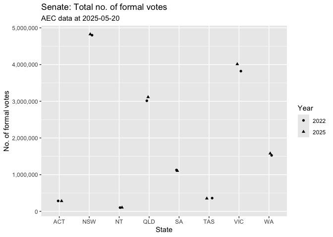
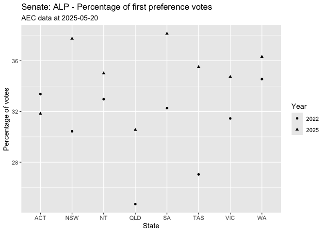

 

# House of Representatives

## Informal votes by state - 2022

<table class="table" style="color: black; width: auto !important; margin-left: auto; margin-right: auto;">
 <thead>
  <tr>
   <th style="text-align:left;"> StateAb </th>
   <th style="text-align:right;"> state_informal </th>
  </tr>
 </thead>
<tbody>
  <tr>
   <td style="text-align:left;"> ACT </td>
   <td style="text-align:right;"> 7116 </td>
  </tr>
  <tr>
   <td style="text-align:left;"> NSW </td>
   <td style="text-align:right;"> 308644 </td>
  </tr>
  <tr>
   <td style="text-align:left;"> NT </td>
   <td style="text-align:right;"> 5658 </td>
  </tr>
  <tr>
   <td style="text-align:left;"> QLD </td>
   <td style="text-align:right;"> 128732 </td>
  </tr>
  <tr>
   <td style="text-align:left;"> SA </td>
   <td style="text-align:right;"> 59222 </td>
  </tr>
  <tr>
   <td style="text-align:left;"> TAS </td>
   <td style="text-align:right;"> 21734 </td>
  </tr>
  <tr>
   <td style="text-align:left;"> VIC </td>
   <td style="text-align:right;"> 185174 </td>
  </tr>
  <tr>
   <td style="text-align:left;"> WA </td>
   <td style="text-align:right;"> 86057 </td>
  </tr>
</tbody>
</table>

 

## Informal votes by state - 2025

<table class="table" style="color: black; width: auto !important; margin-left: auto; margin-right: auto;">
 <thead>
  <tr>
   <th style="text-align:left;"> StateAb </th>
   <th style="text-align:right;"> state_informal </th>
  </tr>
 </thead>
<tbody>
  <tr>
   <td style="text-align:left;"> ACT </td>
   <td style="text-align:right;"> 7182 </td>
  </tr>
  <tr>
   <td style="text-align:left;"> NSW </td>
   <td style="text-align:right;"> 416650 </td>
  </tr>
  <tr>
   <td style="text-align:left;"> NT </td>
   <td style="text-align:right;"> 4378 </td>
  </tr>
  <tr>
   <td style="text-align:left;"> QLD </td>
   <td style="text-align:right;"> 160873 </td>
  </tr>
  <tr>
   <td style="text-align:left;"> SA </td>
   <td style="text-align:right;"> 61994 </td>
  </tr>
  <tr>
   <td style="text-align:left;"> TAS </td>
   <td style="text-align:right;"> 16112 </td>
  </tr>
  <tr>
   <td style="text-align:left;"> VIC </td>
   <td style="text-align:right;"> 176860 </td>
  </tr>
  <tr>
   <td style="text-align:left;"> WA </td>
   <td style="text-align:right;"> 64816 </td>
  </tr>
</tbody>
</table>

 

## Difference in total number of ballot papers lodged between 2022 and 2025

There were 851,702 more voters who voted for the House of 
Reps in 2025 than in 2022.

 

## Votes by state - 2022 and 2025

<table class="table" style="color: black; width: auto !important; margin-left: auto; margin-right: auto;">
 <thead>
  <tr>
   <th style="text-align:left;"> StateAb </th>
   <th style="text-align:center;"> Year </th>
   <th style="text-align:right;"> state_votes </th>
   <th style="text-align:right;"> state_informal </th>
   <th style="text-align:right;"> state_formal </th>
  </tr>
 </thead>
<tbody>
  <tr>
   <td style="text-align:left;"> ACT </td>
   <td style="text-align:center;"> 2022 </td>
   <td style="text-align:right;"> 289,113 </td>
   <td style="text-align:right;"> 7,116 </td>
   <td style="text-align:right;"> 281,997 </td>
  </tr>
  <tr>
   <td style="text-align:left;"> ACT </td>
   <td style="text-align:center;"> 2025 </td>
   <td style="text-align:right;"> 295,057 </td>
   <td style="text-align:right;"> 7,182 </td>
   <td style="text-align:right;"> 287,875 </td>
  </tr>
  <tr>
   <td style="text-align:left;background-color: rgba(238, 238, 238, 255) !important;"> NSW </td>
   <td style="text-align:center;background-color: rgba(238, 238, 238, 255) !important;"> 2022 </td>
   <td style="text-align:right;background-color: rgba(238, 238, 238, 255) !important;"> 4,959,584 </td>
   <td style="text-align:right;background-color: rgba(238, 238, 238, 255) !important;"> 308,644 </td>
   <td style="text-align:right;background-color: rgba(238, 238, 238, 255) !important;"> 4,650,940 </td>
  </tr>
  <tr>
   <td style="text-align:left;background-color: rgba(238, 238, 238, 255) !important;"> NSW </td>
   <td style="text-align:center;background-color: rgba(238, 238, 238, 255) !important;"> 2025 </td>
   <td style="text-align:right;background-color: rgba(238, 238, 238, 255) !important;"> 5,192,534 </td>
   <td style="text-align:right;background-color: rgba(238, 238, 238, 255) !important;"> 416,650 </td>
   <td style="text-align:right;background-color: rgba(238, 238, 238, 255) !important;"> 4,775,884 </td>
  </tr>
  <tr>
   <td style="text-align:left;"> NT </td>
   <td style="text-align:center;"> 2022 </td>
   <td style="text-align:right;"> 106,595 </td>
   <td style="text-align:right;"> 5,658 </td>
   <td style="text-align:right;"> 100,937 </td>
  </tr>
  <tr>
   <td style="text-align:left;"> NT </td>
   <td style="text-align:center;"> 2025 </td>
   <td style="text-align:right;"> 109,612 </td>
   <td style="text-align:right;"> 4,378 </td>
   <td style="text-align:right;"> 105,234 </td>
  </tr>
  <tr>
   <td style="text-align:left;background-color: rgba(238, 238, 238, 255) !important;"> QLD </td>
   <td style="text-align:center;background-color: rgba(238, 238, 238, 255) !important;"> 2022 </td>
   <td style="text-align:right;background-color: rgba(238, 238, 238, 255) !important;"> 3,086,758 </td>
   <td style="text-align:right;background-color: rgba(238, 238, 238, 255) !important;"> 128,732 </td>
   <td style="text-align:right;background-color: rgba(238, 238, 238, 255) !important;"> 2,958,026 </td>
  </tr>
  <tr>
   <td style="text-align:left;background-color: rgba(238, 238, 238, 255) !important;"> QLD </td>
   <td style="text-align:center;background-color: rgba(238, 238, 238, 255) !important;"> 2025 </td>
   <td style="text-align:right;background-color: rgba(238, 238, 238, 255) !important;"> 3,281,760 </td>
   <td style="text-align:right;background-color: rgba(238, 238, 238, 255) !important;"> 160,873 </td>
   <td style="text-align:right;background-color: rgba(238, 238, 238, 255) !important;"> 3,120,887 </td>
  </tr>
  <tr>
   <td style="text-align:left;"> SA </td>
   <td style="text-align:center;"> 2022 </td>
   <td style="text-align:right;"> 1,157,008 </td>
   <td style="text-align:right;"> 59,222 </td>
   <td style="text-align:right;"> 1,097,786 </td>
  </tr>
  <tr>
   <td style="text-align:left;"> SA </td>
   <td style="text-align:center;"> 2025 </td>
   <td style="text-align:right;"> 1,183,352 </td>
   <td style="text-align:right;"> 61,994 </td>
   <td style="text-align:right;"> 1,121,358 </td>
  </tr>
  <tr>
   <td style="text-align:left;background-color: rgba(238, 238, 238, 255) !important;"> TAS </td>
   <td style="text-align:center;background-color: rgba(238, 238, 238, 255) !important;"> 2022 </td>
   <td style="text-align:right;background-color: rgba(238, 238, 238, 255) !important;"> 371,432 </td>
   <td style="text-align:right;background-color: rgba(238, 238, 238, 255) !important;"> 21,734 </td>
   <td style="text-align:right;background-color: rgba(238, 238, 238, 255) !important;"> 349,698 </td>
  </tr>
  <tr>
   <td style="text-align:left;background-color: rgba(238, 238, 238, 255) !important;"> TAS </td>
   <td style="text-align:center;background-color: rgba(238, 238, 238, 255) !important;"> 2025 </td>
   <td style="text-align:right;background-color: rgba(238, 238, 238, 255) !important;"> 381,607 </td>
   <td style="text-align:right;background-color: rgba(238, 238, 238, 255) !important;"> 16,112 </td>
   <td style="text-align:right;background-color: rgba(238, 238, 238, 255) !important;"> 365,495 </td>
  </tr>
  <tr>
   <td style="text-align:left;"> VIC </td>
   <td style="text-align:center;"> 2022 </td>
   <td style="text-align:right;"> 3,931,607 </td>
   <td style="text-align:right;"> 185,174 </td>
   <td style="text-align:right;"> 3,746,433 </td>
  </tr>
  <tr>
   <td style="text-align:left;"> VIC </td>
   <td style="text-align:center;"> 2025 </td>
   <td style="text-align:right;"> 4,215,535 </td>
   <td style="text-align:right;"> 176,860 </td>
   <td style="text-align:right;"> 4,038,675 </td>
  </tr>
  <tr>
   <td style="text-align:left;background-color: rgba(238, 238, 238, 255) !important;"> WA </td>
   <td style="text-align:center;background-color: rgba(238, 238, 238, 255) !important;"> 2022 </td>
   <td style="text-align:right;background-color: rgba(238, 238, 238, 255) !important;"> 1,559,282 </td>
   <td style="text-align:right;background-color: rgba(238, 238, 238, 255) !important;"> 86,057 </td>
   <td style="text-align:right;background-color: rgba(238, 238, 238, 255) !important;"> 1,473,225 </td>
  </tr>
  <tr>
   <td style="text-align:left;background-color: rgba(238, 238, 238, 255) !important;"> WA </td>
   <td style="text-align:center;background-color: rgba(238, 238, 238, 255) !important;"> 2025 </td>
   <td style="text-align:right;background-color: rgba(238, 238, 238, 255) !important;"> 1,653,624 </td>
   <td style="text-align:right;background-color: rgba(238, 238, 238, 255) !important;"> 64,816 </td>
   <td style="text-align:right;background-color: rgba(238, 238, 238, 255) !important;"> 1,588,808 </td>
  </tr>
</tbody>
</table>
 

<!-- -->

 

## House of Reps: Percentage of first preference votes for ALP - 2022 and 2025

<table class="table" style="color: black; width: auto !important; margin-left: auto; margin-right: auto;">
 <thead>
  <tr>
   <th style="text-align:left;"> StateAb </th>
   <th style="text-align:center;"> Year </th>
   <th style="text-align:right;"> state_votes </th>
   <th style="text-align:right;"> state_informal </th>
   <th style="text-align:right;"> state_formal </th>
   <th style="text-align:right;"> alp_votes </th>
   <th style="text-align:right;"> alp_pc </th>
  </tr>
 </thead>
<tbody>
  <tr>
   <td style="text-align:left;"> ACT </td>
   <td style="text-align:center;"> 2022 </td>
   <td style="text-align:right;"> 289,113 </td>
   <td style="text-align:right;"> 7,116 </td>
   <td style="text-align:right;"> 281,997 </td>
   <td style="text-align:right;"> 126,595 </td>
   <td style="text-align:right;"> 44.9 </td>
  </tr>
  <tr>
   <td style="text-align:left;"> ACT </td>
   <td style="text-align:center;"> 2025 </td>
   <td style="text-align:right;"> 295,057 </td>
   <td style="text-align:right;"> 7,182 </td>
   <td style="text-align:right;"> 287,875 </td>
   <td style="text-align:right;"> 136,874 </td>
   <td style="text-align:right;"> 47.5 </td>
  </tr>
  <tr>
   <td style="text-align:left;background-color: rgba(238, 238, 238, 255) !important;"> NSW </td>
   <td style="text-align:center;background-color: rgba(238, 238, 238, 255) !important;"> 2022 </td>
   <td style="text-align:right;background-color: rgba(238, 238, 238, 255) !important;"> 4,959,584 </td>
   <td style="text-align:right;background-color: rgba(238, 238, 238, 255) !important;"> 308,644 </td>
   <td style="text-align:right;background-color: rgba(238, 238, 238, 255) !important;"> 4,650,940 </td>
   <td style="text-align:right;background-color: rgba(238, 238, 238, 255) !important;"> 1,552,684 </td>
   <td style="text-align:right;background-color: rgba(238, 238, 238, 255) !important;"> 33.4 </td>
  </tr>
  <tr>
   <td style="text-align:left;background-color: rgba(238, 238, 238, 255) !important;"> NSW </td>
   <td style="text-align:center;background-color: rgba(238, 238, 238, 255) !important;"> 2025 </td>
   <td style="text-align:right;background-color: rgba(238, 238, 238, 255) !important;"> 5,192,534 </td>
   <td style="text-align:right;background-color: rgba(238, 238, 238, 255) !important;"> 416,650 </td>
   <td style="text-align:right;background-color: rgba(238, 238, 238, 255) !important;"> 4,775,884 </td>
   <td style="text-align:right;background-color: rgba(238, 238, 238, 255) !important;"> 1,680,162 </td>
   <td style="text-align:right;background-color: rgba(238, 238, 238, 255) !important;"> 35.2 </td>
  </tr>
  <tr>
   <td style="text-align:left;"> NT </td>
   <td style="text-align:center;"> 2022 </td>
   <td style="text-align:right;"> 106,595 </td>
   <td style="text-align:right;"> 5,658 </td>
   <td style="text-align:right;"> 100,937 </td>
   <td style="text-align:right;"> 38,522 </td>
   <td style="text-align:right;"> 38.2 </td>
  </tr>
  <tr>
   <td style="text-align:left;"> NT </td>
   <td style="text-align:center;"> 2025 </td>
   <td style="text-align:right;"> 109,612 </td>
   <td style="text-align:right;"> 4,378 </td>
   <td style="text-align:right;"> 105,234 </td>
   <td style="text-align:right;"> 39,968 </td>
   <td style="text-align:right;"> 38.0 </td>
  </tr>
  <tr>
   <td style="text-align:left;background-color: rgba(238, 238, 238, 255) !important;"> QLD </td>
   <td style="text-align:center;background-color: rgba(238, 238, 238, 255) !important;"> 2022 </td>
   <td style="text-align:right;background-color: rgba(238, 238, 238, 255) !important;"> 3,086,758 </td>
   <td style="text-align:right;background-color: rgba(238, 238, 238, 255) !important;"> 128,732 </td>
   <td style="text-align:right;background-color: rgba(238, 238, 238, 255) !important;"> 2,958,026 </td>
   <td style="text-align:right;background-color: rgba(238, 238, 238, 255) !important;"> 811,069 </td>
   <td style="text-align:right;background-color: rgba(238, 238, 238, 255) !important;"> 27.4 </td>
  </tr>
  <tr>
   <td style="text-align:left;background-color: rgba(238, 238, 238, 255) !important;"> QLD </td>
   <td style="text-align:center;background-color: rgba(238, 238, 238, 255) !important;"> 2025 </td>
   <td style="text-align:right;background-color: rgba(238, 238, 238, 255) !important;"> 3,281,760 </td>
   <td style="text-align:right;background-color: rgba(238, 238, 238, 255) !important;"> 160,873 </td>
   <td style="text-align:right;background-color: rgba(238, 238, 238, 255) !important;"> 3,120,887 </td>
   <td style="text-align:right;background-color: rgba(238, 238, 238, 255) !important;"> 967,741 </td>
   <td style="text-align:right;background-color: rgba(238, 238, 238, 255) !important;"> 31.0 </td>
  </tr>
  <tr>
   <td style="text-align:left;"> SA </td>
   <td style="text-align:center;"> 2022 </td>
   <td style="text-align:right;"> 1,157,008 </td>
   <td style="text-align:right;"> 59,222 </td>
   <td style="text-align:right;"> 1,097,786 </td>
   <td style="text-align:right;"> 378,329 </td>
   <td style="text-align:right;"> 34.5 </td>
  </tr>
  <tr>
   <td style="text-align:left;"> SA </td>
   <td style="text-align:center;"> 2025 </td>
   <td style="text-align:right;"> 1,183,352 </td>
   <td style="text-align:right;"> 61,994 </td>
   <td style="text-align:right;"> 1,121,358 </td>
   <td style="text-align:right;"> 429,611 </td>
   <td style="text-align:right;"> 38.3 </td>
  </tr>
  <tr>
   <td style="text-align:left;background-color: rgba(238, 238, 238, 255) !important;"> TAS </td>
   <td style="text-align:center;background-color: rgba(238, 238, 238, 255) !important;"> 2022 </td>
   <td style="text-align:right;background-color: rgba(238, 238, 238, 255) !important;"> 371,432 </td>
   <td style="text-align:right;background-color: rgba(238, 238, 238, 255) !important;"> 21,734 </td>
   <td style="text-align:right;background-color: rgba(238, 238, 238, 255) !important;"> 349,698 </td>
   <td style="text-align:right;background-color: rgba(238, 238, 238, 255) !important;"> 95,322 </td>
   <td style="text-align:right;background-color: rgba(238, 238, 238, 255) !important;"> 27.3 </td>
  </tr>
  <tr>
   <td style="text-align:left;background-color: rgba(238, 238, 238, 255) !important;"> TAS </td>
   <td style="text-align:center;background-color: rgba(238, 238, 238, 255) !important;"> 2025 </td>
   <td style="text-align:right;background-color: rgba(238, 238, 238, 255) !important;"> 381,607 </td>
   <td style="text-align:right;background-color: rgba(238, 238, 238, 255) !important;"> 16,112 </td>
   <td style="text-align:right;background-color: rgba(238, 238, 238, 255) !important;"> 365,495 </td>
   <td style="text-align:right;background-color: rgba(238, 238, 238, 255) !important;"> 133,779 </td>
   <td style="text-align:right;background-color: rgba(238, 238, 238, 255) !important;"> 36.6 </td>
  </tr>
  <tr>
   <td style="text-align:left;"> VIC </td>
   <td style="text-align:center;"> 2022 </td>
   <td style="text-align:right;"> 3,931,607 </td>
   <td style="text-align:right;"> 185,174 </td>
   <td style="text-align:right;"> 3,746,433 </td>
   <td style="text-align:right;"> 1,230,842 </td>
   <td style="text-align:right;"> 32.9 </td>
  </tr>
  <tr>
   <td style="text-align:left;"> VIC </td>
   <td style="text-align:center;"> 2025 </td>
   <td style="text-align:right;"> 4,215,535 </td>
   <td style="text-align:right;"> 176,860 </td>
   <td style="text-align:right;"> 4,038,675 </td>
   <td style="text-align:right;"> 1,370,555 </td>
   <td style="text-align:right;"> 33.9 </td>
  </tr>
  <tr>
   <td style="text-align:left;background-color: rgba(238, 238, 238, 255) !important;"> WA </td>
   <td style="text-align:center;background-color: rgba(238, 238, 238, 255) !important;"> 2022 </td>
   <td style="text-align:right;background-color: rgba(238, 238, 238, 255) !important;"> 1,559,282 </td>
   <td style="text-align:right;background-color: rgba(238, 238, 238, 255) !important;"> 86,057 </td>
   <td style="text-align:right;background-color: rgba(238, 238, 238, 255) !important;"> 1,473,225 </td>
   <td style="text-align:right;background-color: rgba(238, 238, 238, 255) !important;"> 542,667 </td>
   <td style="text-align:right;background-color: rgba(238, 238, 238, 255) !important;"> 36.8 </td>
  </tr>
  <tr>
   <td style="text-align:left;background-color: rgba(238, 238, 238, 255) !important;"> WA </td>
   <td style="text-align:center;background-color: rgba(238, 238, 238, 255) !important;"> 2025 </td>
   <td style="text-align:right;background-color: rgba(238, 238, 238, 255) !important;"> 1,653,624 </td>
   <td style="text-align:right;background-color: rgba(238, 238, 238, 255) !important;"> 64,816 </td>
   <td style="text-align:right;background-color: rgba(238, 238, 238, 255) !important;"> 1,588,808 </td>
   <td style="text-align:right;background-color: rgba(238, 238, 238, 255) !important;"> 565,705 </td>
   <td style="text-align:right;background-color: rgba(238, 238, 238, 255) !important;"> 35.6 </td>
  </tr>
</tbody>
</table>

 

<!-- -->

 

 

## House of Reps: Percentage of first preference votes for the Greens - 2022 and 2025

There are three separate figures for the Greens in the AEC voting figures: Australian Greens, Qld Greens and WA Greens. 

<table class="table" style="color: black; width: auto !important; margin-left: auto; margin-right: auto;">
 <thead>
  <tr>
   <th style="text-align:left;"> StateAb </th>
   <th style="text-align:center;"> Year </th>
   <th style="text-align:right;"> state_votes </th>
   <th style="text-align:right;"> state_informal </th>
   <th style="text-align:right;"> state_formal </th>
   <th style="text-align:right;"> grn_votes </th>
   <th style="text-align:right;"> grn_pc </th>
  </tr>
 </thead>
<tbody>
  <tr>
   <td style="text-align:left;"> ACT </td>
   <td style="text-align:center;"> 2022 </td>
   <td style="text-align:right;"> 289,113 </td>
   <td style="text-align:right;"> 7,116 </td>
   <td style="text-align:right;"> 281,997 </td>
   <td style="text-align:right;"> 52,648 </td>
   <td style="text-align:right;"> 18.7 </td>
  </tr>
  <tr>
   <td style="text-align:left;"> ACT </td>
   <td style="text-align:center;"> 2025 </td>
   <td style="text-align:right;"> 295,057 </td>
   <td style="text-align:right;"> 7,182 </td>
   <td style="text-align:right;"> 287,875 </td>
   <td style="text-align:right;"> 43,188 </td>
   <td style="text-align:right;"> 15.0 </td>
  </tr>
  <tr>
   <td style="text-align:left;background-color: rgba(238, 238, 238, 255) !important;"> NSW </td>
   <td style="text-align:center;background-color: rgba(238, 238, 238, 255) !important;"> 2022 </td>
   <td style="text-align:right;background-color: rgba(238, 238, 238, 255) !important;"> 4,959,584 </td>
   <td style="text-align:right;background-color: rgba(238, 238, 238, 255) !important;"> 308,644 </td>
   <td style="text-align:right;background-color: rgba(238, 238, 238, 255) !important;"> 4,650,940 </td>
   <td style="text-align:right;background-color: rgba(238, 238, 238, 255) !important;"> 466,069 </td>
   <td style="text-align:right;background-color: rgba(238, 238, 238, 255) !important;"> 10.0 </td>
  </tr>
  <tr>
   <td style="text-align:left;background-color: rgba(238, 238, 238, 255) !important;"> NSW </td>
   <td style="text-align:center;background-color: rgba(238, 238, 238, 255) !important;"> 2025 </td>
   <td style="text-align:right;background-color: rgba(238, 238, 238, 255) !important;"> 5,192,534 </td>
   <td style="text-align:right;background-color: rgba(238, 238, 238, 255) !important;"> 416,650 </td>
   <td style="text-align:right;background-color: rgba(238, 238, 238, 255) !important;"> 4,775,884 </td>
   <td style="text-align:right;background-color: rgba(238, 238, 238, 255) !important;"> 526,862 </td>
   <td style="text-align:right;background-color: rgba(238, 238, 238, 255) !important;"> 11.0 </td>
  </tr>
  <tr>
   <td style="text-align:left;"> NT </td>
   <td style="text-align:center;"> 2022 </td>
   <td style="text-align:right;"> 106,595 </td>
   <td style="text-align:right;"> 5,658 </td>
   <td style="text-align:right;"> 100,937 </td>
   <td style="text-align:right;"> 13,182 </td>
   <td style="text-align:right;"> 13.1 </td>
  </tr>
  <tr>
   <td style="text-align:left;"> NT </td>
   <td style="text-align:center;"> 2025 </td>
   <td style="text-align:right;"> 109,612 </td>
   <td style="text-align:right;"> 4,378 </td>
   <td style="text-align:right;"> 105,234 </td>
   <td style="text-align:right;"> 10,710 </td>
   <td style="text-align:right;"> 10.2 </td>
  </tr>
  <tr>
   <td style="text-align:left;background-color: rgba(238, 238, 238, 255) !important;"> QLD </td>
   <td style="text-align:center;background-color: rgba(238, 238, 238, 255) !important;"> 2022 </td>
   <td style="text-align:right;background-color: rgba(238, 238, 238, 255) !important;"> 3,086,758 </td>
   <td style="text-align:right;background-color: rgba(238, 238, 238, 255) !important;"> 128,732 </td>
   <td style="text-align:right;background-color: rgba(238, 238, 238, 255) !important;"> 2,958,026 </td>
   <td style="text-align:right;background-color: rgba(238, 238, 238, 255) !important;"> 382,900 </td>
   <td style="text-align:right;background-color: rgba(238, 238, 238, 255) !important;"> 12.9 </td>
  </tr>
  <tr>
   <td style="text-align:left;background-color: rgba(238, 238, 238, 255) !important;"> QLD </td>
   <td style="text-align:center;background-color: rgba(238, 238, 238, 255) !important;"> 2025 </td>
   <td style="text-align:right;background-color: rgba(238, 238, 238, 255) !important;"> 3,281,760 </td>
   <td style="text-align:right;background-color: rgba(238, 238, 238, 255) !important;"> 160,873 </td>
   <td style="text-align:right;background-color: rgba(238, 238, 238, 255) !important;"> 3,120,887 </td>
   <td style="text-align:right;background-color: rgba(238, 238, 238, 255) !important;"> 366,176 </td>
   <td style="text-align:right;background-color: rgba(238, 238, 238, 255) !important;"> 11.7 </td>
  </tr>
  <tr>
   <td style="text-align:left;"> SA </td>
   <td style="text-align:center;"> 2022 </td>
   <td style="text-align:right;"> 1,157,008 </td>
   <td style="text-align:right;"> 59,222 </td>
   <td style="text-align:right;"> 1,097,786 </td>
   <td style="text-align:right;"> 140,227 </td>
   <td style="text-align:right;"> 12.8 </td>
  </tr>
  <tr>
   <td style="text-align:left;"> SA </td>
   <td style="text-align:center;"> 2025 </td>
   <td style="text-align:right;"> 1,183,352 </td>
   <td style="text-align:right;"> 61,994 </td>
   <td style="text-align:right;"> 1,121,358 </td>
   <td style="text-align:right;"> 149,825 </td>
   <td style="text-align:right;"> 13.4 </td>
  </tr>
  <tr>
   <td style="text-align:left;background-color: rgba(238, 238, 238, 255) !important;"> TAS </td>
   <td style="text-align:center;background-color: rgba(238, 238, 238, 255) !important;"> 2022 </td>
   <td style="text-align:right;background-color: rgba(238, 238, 238, 255) !important;"> 371,432 </td>
   <td style="text-align:right;background-color: rgba(238, 238, 238, 255) !important;"> 21,734 </td>
   <td style="text-align:right;background-color: rgba(238, 238, 238, 255) !important;"> 349,698 </td>
   <td style="text-align:right;background-color: rgba(238, 238, 238, 255) !important;"> 41,972 </td>
   <td style="text-align:right;background-color: rgba(238, 238, 238, 255) !important;"> 12.0 </td>
  </tr>
  <tr>
   <td style="text-align:left;background-color: rgba(238, 238, 238, 255) !important;"> TAS </td>
   <td style="text-align:center;background-color: rgba(238, 238, 238, 255) !important;"> 2025 </td>
   <td style="text-align:right;background-color: rgba(238, 238, 238, 255) !important;"> 381,607 </td>
   <td style="text-align:right;background-color: rgba(238, 238, 238, 255) !important;"> 16,112 </td>
   <td style="text-align:right;background-color: rgba(238, 238, 238, 255) !important;"> 365,495 </td>
   <td style="text-align:right;background-color: rgba(238, 238, 238, 255) !important;"> 40,565 </td>
   <td style="text-align:right;background-color: rgba(238, 238, 238, 255) !important;"> 11.1 </td>
  </tr>
  <tr>
   <td style="text-align:left;"> VIC </td>
   <td style="text-align:center;"> 2022 </td>
   <td style="text-align:right;"> 3,931,607 </td>
   <td style="text-align:right;"> 185,174 </td>
   <td style="text-align:right;"> 3,746,433 </td>
   <td style="text-align:right;"> 514,893 </td>
   <td style="text-align:right;"> 13.7 </td>
  </tr>
  <tr>
   <td style="text-align:left;"> VIC </td>
   <td style="text-align:center;"> 2025 </td>
   <td style="text-align:right;"> 4,215,535 </td>
   <td style="text-align:right;"> 176,860 </td>
   <td style="text-align:right;"> 4,038,675 </td>
   <td style="text-align:right;"> 546,744 </td>
   <td style="text-align:right;"> 13.5 </td>
  </tr>
  <tr>
   <td style="text-align:left;background-color: rgba(238, 238, 238, 255) !important;"> WA </td>
   <td style="text-align:center;background-color: rgba(238, 238, 238, 255) !important;"> 2022 </td>
   <td style="text-align:right;background-color: rgba(238, 238, 238, 255) !important;"> 1,559,282 </td>
   <td style="text-align:right;background-color: rgba(238, 238, 238, 255) !important;"> 86,057 </td>
   <td style="text-align:right;background-color: rgba(238, 238, 238, 255) !important;"> 1,473,225 </td>
   <td style="text-align:right;background-color: rgba(238, 238, 238, 255) !important;"> 184,094 </td>
   <td style="text-align:right;background-color: rgba(238, 238, 238, 255) !important;"> 12.5 </td>
  </tr>
  <tr>
   <td style="text-align:left;background-color: rgba(238, 238, 238, 255) !important;"> WA </td>
   <td style="text-align:center;background-color: rgba(238, 238, 238, 255) !important;"> 2025 </td>
   <td style="text-align:right;background-color: rgba(238, 238, 238, 255) !important;"> 1,653,624 </td>
   <td style="text-align:right;background-color: rgba(238, 238, 238, 255) !important;"> 64,816 </td>
   <td style="text-align:right;background-color: rgba(238, 238, 238, 255) !important;"> 1,588,808 </td>
   <td style="text-align:right;background-color: rgba(238, 238, 238, 255) !important;"> 189,804 </td>
   <td style="text-align:right;background-color: rgba(238, 238, 238, 255) !important;"> 11.9 </td>
  </tr>
</tbody>
</table>

 

<!-- -->

 

## House of Reps NSW: Greens votes in 2022 and 2025

 
 

# Senate

 

## Informal votes by state - 2022

Informal Senate votes have already been removed by the Australian Electoral Commission in the data available for importing.

 

## Informal votes by state - 2025

Informal Senate votes have already been removed by the Australian Electoral Commission in the data available for importing.

 

## Difference in total number of ballot papers lodged between 2022 and 2025

There were 334,071 more people who lodged formal votes for the Senate in 2025 than in 2022.

 

## Votes by state - 2022 and 2025

<table class="table" style="color: black; width: auto !important; margin-left: auto; margin-right: auto;">
 <thead>
  <tr>
   <th style="text-align:left;"> StateAb </th>
   <th style="text-align:center;"> Year </th>
   <th style="text-align:right;"> state_votes </th>
   <th style="text-align:right;"> state_formal </th>
  </tr>
 </thead>
<tbody>
  <tr>
   <td style="text-align:left;"> ACT </td>
   <td style="text-align:center;"> 2022 </td>
   <td style="text-align:right;"> 285,217 </td>
   <td style="text-align:right;"> 285,217 </td>
  </tr>
  <tr>
   <td style="text-align:left;"> ACT </td>
   <td style="text-align:center;"> 2025 </td>
   <td style="text-align:right;"> 282,350 </td>
   <td style="text-align:right;"> 282,350 </td>
  </tr>
  <tr>
   <td style="text-align:left;background-color: rgba(238, 238, 238, 255) !important;"> NSW </td>
   <td style="text-align:center;background-color: rgba(238, 238, 238, 255) !important;"> 2022 </td>
   <td style="text-align:right;background-color: rgba(238, 238, 238, 255) !important;"> 4,800,722 </td>
   <td style="text-align:right;background-color: rgba(238, 238, 238, 255) !important;"> 4,800,722 </td>
  </tr>
  <tr>
   <td style="text-align:left;background-color: rgba(238, 238, 238, 255) !important;"> NSW </td>
   <td style="text-align:center;background-color: rgba(238, 238, 238, 255) !important;"> 2025 </td>
   <td style="text-align:right;background-color: rgba(238, 238, 238, 255) !important;"> 4,825,403 </td>
   <td style="text-align:right;background-color: rgba(238, 238, 238, 255) !important;"> 4,825,403 </td>
  </tr>
  <tr>
   <td style="text-align:left;"> NT </td>
   <td style="text-align:center;"> 2022 </td>
   <td style="text-align:right;"> 103,617 </td>
   <td style="text-align:right;"> 103,617 </td>
  </tr>
  <tr>
   <td style="text-align:left;"> NT </td>
   <td style="text-align:center;"> 2025 </td>
   <td style="text-align:right;"> 104,919 </td>
   <td style="text-align:right;"> 104,919 </td>
  </tr>
  <tr>
   <td style="text-align:left;background-color: rgba(238, 238, 238, 255) !important;"> QLD </td>
   <td style="text-align:center;background-color: rgba(238, 238, 238, 255) !important;"> 2022 </td>
   <td style="text-align:right;background-color: rgba(238, 238, 238, 255) !important;"> 3,013,868 </td>
   <td style="text-align:right;background-color: rgba(238, 238, 238, 255) !important;"> 3,013,868 </td>
  </tr>
  <tr>
   <td style="text-align:left;background-color: rgba(238, 238, 238, 255) !important;"> QLD </td>
   <td style="text-align:center;background-color: rgba(238, 238, 238, 255) !important;"> 2025 </td>
   <td style="text-align:right;background-color: rgba(238, 238, 238, 255) !important;"> 3,113,272 </td>
   <td style="text-align:right;background-color: rgba(238, 238, 238, 255) !important;"> 3,113,272 </td>
  </tr>
  <tr>
   <td style="text-align:left;"> SA </td>
   <td style="text-align:center;"> 2022 </td>
   <td style="text-align:right;"> 1,128,524 </td>
   <td style="text-align:right;"> 1,128,524 </td>
  </tr>
  <tr>
   <td style="text-align:left;"> SA </td>
   <td style="text-align:center;"> 2025 </td>
   <td style="text-align:right;"> 1,105,240 </td>
   <td style="text-align:right;"> 1,105,240 </td>
  </tr>
  <tr>
   <td style="text-align:left;background-color: rgba(238, 238, 238, 255) !important;"> TAS </td>
   <td style="text-align:center;background-color: rgba(238, 238, 238, 255) !important;"> 2022 </td>
   <td style="text-align:right;background-color: rgba(238, 238, 238, 255) !important;"> 361,048 </td>
   <td style="text-align:right;background-color: rgba(238, 238, 238, 255) !important;"> 361,048 </td>
  </tr>
  <tr>
   <td style="text-align:left;background-color: rgba(238, 238, 238, 255) !important;"> TAS </td>
   <td style="text-align:center;background-color: rgba(238, 238, 238, 255) !important;"> 2025 </td>
   <td style="text-align:right;background-color: rgba(238, 238, 238, 255) !important;"> 352,338 </td>
   <td style="text-align:right;background-color: rgba(238, 238, 238, 255) !important;"> 352,338 </td>
  </tr>
  <tr>
   <td style="text-align:left;"> VIC </td>
   <td style="text-align:center;"> 2022 </td>
   <td style="text-align:right;"> 3,821,539 </td>
   <td style="text-align:right;"> 3,821,539 </td>
  </tr>
  <tr>
   <td style="text-align:left;"> VIC </td>
   <td style="text-align:center;"> 2025 </td>
   <td style="text-align:right;"> 4,012,031 </td>
   <td style="text-align:right;"> 4,012,031 </td>
  </tr>
  <tr>
   <td style="text-align:left;background-color: rgba(238, 238, 238, 255) !important;"> WA </td>
   <td style="text-align:center;background-color: rgba(238, 238, 238, 255) !important;"> 2022 </td>
   <td style="text-align:right;background-color: rgba(238, 238, 238, 255) !important;"> 1,526,123 </td>
   <td style="text-align:right;background-color: rgba(238, 238, 238, 255) !important;"> 1,526,123 </td>
  </tr>
  <tr>
   <td style="text-align:left;background-color: rgba(238, 238, 238, 255) !important;"> WA </td>
   <td style="text-align:center;background-color: rgba(238, 238, 238, 255) !important;"> 2025 </td>
   <td style="text-align:right;background-color: rgba(238, 238, 238, 255) !important;"> 1,579,176 </td>
   <td style="text-align:right;background-color: rgba(238, 238, 238, 255) !important;"> 1,579,176 </td>
  </tr>
</tbody>
</table>

 

<!-- -->

 

## Senate: Percentage of first preference votes for ALP - 2022 and 2025

<table class="table" style="color: black; width: auto !important; margin-left: auto; margin-right: auto;">
 <thead>
  <tr>
   <th style="text-align:left;"> StateAb </th>
   <th style="text-align:center;"> Year </th>
   <th style="text-align:right;"> state_votes </th>
   <th style="text-align:right;"> state_formal </th>
   <th style="text-align:right;"> alp_votes </th>
   <th style="text-align:right;"> alp_pc </th>
  </tr>
 </thead>
<tbody>
  <tr>
   <td style="text-align:left;"> ACT </td>
   <td style="text-align:center;"> 2022 </td>
   <td style="text-align:right;"> 285,217 </td>
   <td style="text-align:right;"> 285,217 </td>
   <td style="text-align:right;"> 95,184 </td>
   <td style="text-align:right;"> 33.4 </td>
  </tr>
  <tr>
   <td style="text-align:left;"> ACT </td>
   <td style="text-align:center;"> 2025 </td>
   <td style="text-align:right;"> 282,350 </td>
   <td style="text-align:right;"> 282,350 </td>
   <td style="text-align:right;"> 89,760 </td>
   <td style="text-align:right;"> 31.8 </td>
  </tr>
  <tr>
   <td style="text-align:left;background-color: rgba(238, 238, 238, 255) !important;"> NSW </td>
   <td style="text-align:center;background-color: rgba(238, 238, 238, 255) !important;"> 2022 </td>
   <td style="text-align:right;background-color: rgba(238, 238, 238, 255) !important;"> 4,800,722 </td>
   <td style="text-align:right;background-color: rgba(238, 238, 238, 255) !important;"> 4,800,722 </td>
   <td style="text-align:right;background-color: rgba(238, 238, 238, 255) !important;"> 1,461,172 </td>
   <td style="text-align:right;background-color: rgba(238, 238, 238, 255) !important;"> 30.4 </td>
  </tr>
  <tr>
   <td style="text-align:left;background-color: rgba(238, 238, 238, 255) !important;"> NSW </td>
   <td style="text-align:center;background-color: rgba(238, 238, 238, 255) !important;"> 2025 </td>
   <td style="text-align:right;background-color: rgba(238, 238, 238, 255) !important;"> 4,825,403 </td>
   <td style="text-align:right;background-color: rgba(238, 238, 238, 255) !important;"> 4,825,403 </td>
   <td style="text-align:right;background-color: rgba(238, 238, 238, 255) !important;"> 1,822,595 </td>
   <td style="text-align:right;background-color: rgba(238, 238, 238, 255) !important;"> 37.8 </td>
  </tr>
  <tr>
   <td style="text-align:left;"> NT </td>
   <td style="text-align:center;"> 2022 </td>
   <td style="text-align:right;"> 103,617 </td>
   <td style="text-align:right;"> 103,617 </td>
   <td style="text-align:right;"> 34,163 </td>
   <td style="text-align:right;"> 33.0 </td>
  </tr>
  <tr>
   <td style="text-align:left;"> NT </td>
   <td style="text-align:center;"> 2025 </td>
   <td style="text-align:right;"> 104,919 </td>
   <td style="text-align:right;"> 104,919 </td>
   <td style="text-align:right;"> 36,821 </td>
   <td style="text-align:right;"> 35.1 </td>
  </tr>
  <tr>
   <td style="text-align:left;background-color: rgba(238, 238, 238, 255) !important;"> QLD </td>
   <td style="text-align:center;background-color: rgba(238, 238, 238, 255) !important;"> 2022 </td>
   <td style="text-align:right;background-color: rgba(238, 238, 238, 255) !important;"> 3,013,868 </td>
   <td style="text-align:right;background-color: rgba(238, 238, 238, 255) !important;"> 3,013,868 </td>
   <td style="text-align:right;background-color: rgba(238, 238, 238, 255) !important;"> 744,212 </td>
   <td style="text-align:right;background-color: rgba(238, 238, 238, 255) !important;"> 24.7 </td>
  </tr>
  <tr>
   <td style="text-align:left;background-color: rgba(238, 238, 238, 255) !important;"> QLD </td>
   <td style="text-align:center;background-color: rgba(238, 238, 238, 255) !important;"> 2025 </td>
   <td style="text-align:right;background-color: rgba(238, 238, 238, 255) !important;"> 3,113,272 </td>
   <td style="text-align:right;background-color: rgba(238, 238, 238, 255) !important;"> 3,113,272 </td>
   <td style="text-align:right;background-color: rgba(238, 238, 238, 255) !important;"> 952,757 </td>
   <td style="text-align:right;background-color: rgba(238, 238, 238, 255) !important;"> 30.6 </td>
  </tr>
  <tr>
   <td style="text-align:left;"> SA </td>
   <td style="text-align:center;"> 2022 </td>
   <td style="text-align:right;"> 1,128,524 </td>
   <td style="text-align:right;"> 1,128,524 </td>
   <td style="text-align:right;"> 364,104 </td>
   <td style="text-align:right;"> 32.3 </td>
  </tr>
  <tr>
   <td style="text-align:left;"> SA </td>
   <td style="text-align:center;"> 2025 </td>
   <td style="text-align:right;"> 1,105,240 </td>
   <td style="text-align:right;"> 1,105,240 </td>
   <td style="text-align:right;"> 423,727 </td>
   <td style="text-align:right;"> 38.3 </td>
  </tr>
  <tr>
   <td style="text-align:left;background-color: rgba(238, 238, 238, 255) !important;"> TAS </td>
   <td style="text-align:center;background-color: rgba(238, 238, 238, 255) !important;"> 2022 </td>
   <td style="text-align:right;background-color: rgba(238, 238, 238, 255) !important;"> 361,048 </td>
   <td style="text-align:right;background-color: rgba(238, 238, 238, 255) !important;"> 361,048 </td>
   <td style="text-align:right;background-color: rgba(238, 238, 238, 255) !important;"> 97,614 </td>
   <td style="text-align:right;background-color: rgba(238, 238, 238, 255) !important;"> 27.0 </td>
  </tr>
  <tr>
   <td style="text-align:left;background-color: rgba(238, 238, 238, 255) !important;"> TAS </td>
   <td style="text-align:center;background-color: rgba(238, 238, 238, 255) !important;"> 2025 </td>
   <td style="text-align:right;background-color: rgba(238, 238, 238, 255) !important;"> 352,338 </td>
   <td style="text-align:right;background-color: rgba(238, 238, 238, 255) !important;"> 352,338 </td>
   <td style="text-align:right;background-color: rgba(238, 238, 238, 255) !important;"> 125,202 </td>
   <td style="text-align:right;background-color: rgba(238, 238, 238, 255) !important;"> 35.5 </td>
  </tr>
  <tr>
   <td style="text-align:left;"> VIC </td>
   <td style="text-align:center;"> 2022 </td>
   <td style="text-align:right;"> 3,821,539 </td>
   <td style="text-align:right;"> 3,821,539 </td>
   <td style="text-align:right;"> 1,201,830 </td>
   <td style="text-align:right;"> 31.4 </td>
  </tr>
  <tr>
   <td style="text-align:left;"> VIC </td>
   <td style="text-align:center;"> 2025 </td>
   <td style="text-align:right;"> 4,012,031 </td>
   <td style="text-align:right;"> 4,012,031 </td>
   <td style="text-align:right;"> 1,394,961 </td>
   <td style="text-align:right;"> 34.8 </td>
  </tr>
  <tr>
   <td style="text-align:left;background-color: rgba(238, 238, 238, 255) !important;"> WA </td>
   <td style="text-align:center;background-color: rgba(238, 238, 238, 255) !important;"> 2022 </td>
   <td style="text-align:right;background-color: rgba(238, 238, 238, 255) !important;"> 1,526,123 </td>
   <td style="text-align:right;background-color: rgba(238, 238, 238, 255) !important;"> 1,526,123 </td>
   <td style="text-align:right;background-color: rgba(238, 238, 238, 255) !important;"> 527,319 </td>
   <td style="text-align:right;background-color: rgba(238, 238, 238, 255) !important;"> 34.6 </td>
  </tr>
  <tr>
   <td style="text-align:left;background-color: rgba(238, 238, 238, 255) !important;"> WA </td>
   <td style="text-align:center;background-color: rgba(238, 238, 238, 255) !important;"> 2025 </td>
   <td style="text-align:right;background-color: rgba(238, 238, 238, 255) !important;"> 1,579,176 </td>
   <td style="text-align:right;background-color: rgba(238, 238, 238, 255) !important;"> 1,579,176 </td>
   <td style="text-align:right;background-color: rgba(238, 238, 238, 255) !important;"> 574,950 </td>
   <td style="text-align:right;background-color: rgba(238, 238, 238, 255) !important;"> 36.4 </td>
  </tr>
</tbody>
</table>

 

<!-- -->

 

 

## Senate: Percentage of first preference votes for the Greens - 2022 and 2025

The Greens go by different party names, depending on their state: Australian Greens, Qld Greens and WA Greens. All are identified by the same abbreviation, GRN, in the AEC data.

<table class="table" style="color: black; width: auto !important; margin-left: auto; margin-right: auto;">
 <thead>
  <tr>
   <th style="text-align:left;"> StateAb </th>
   <th style="text-align:center;"> Year </th>
   <th style="text-align:right;"> state_votes </th>
   <th style="text-align:right;"> state_formal </th>
   <th style="text-align:right;"> grn_votes </th>
   <th style="text-align:right;"> grn_pc </th>
  </tr>
 </thead>
<tbody>
  <tr>
   <td style="text-align:left;"> ACT </td>
   <td style="text-align:center;"> 2022 </td>
   <td style="text-align:right;"> 285,217 </td>
   <td style="text-align:right;"> 285,217 </td>
   <td style="text-align:right;"> 29,360 </td>
   <td style="text-align:right;"> 10.3 </td>
  </tr>
  <tr>
   <td style="text-align:left;"> ACT </td>
   <td style="text-align:center;"> 2025 </td>
   <td style="text-align:right;"> 282,350 </td>
   <td style="text-align:right;"> 282,350 </td>
   <td style="text-align:right;"> 21,912 </td>
   <td style="text-align:right;"> 7.8 </td>
  </tr>
  <tr>
   <td style="text-align:left;background-color: rgba(238, 238, 238, 255) !important;"> NSW </td>
   <td style="text-align:center;background-color: rgba(238, 238, 238, 255) !important;"> 2022 </td>
   <td style="text-align:right;background-color: rgba(238, 238, 238, 255) !important;"> 4,800,722 </td>
   <td style="text-align:right;background-color: rgba(238, 238, 238, 255) !important;"> 4,800,722 </td>
   <td style="text-align:right;background-color: rgba(238, 238, 238, 255) !important;"> 550,069 </td>
   <td style="text-align:right;background-color: rgba(238, 238, 238, 255) !important;"> 11.5 </td>
  </tr>
  <tr>
   <td style="text-align:left;background-color: rgba(238, 238, 238, 255) !important;"> NSW </td>
   <td style="text-align:center;background-color: rgba(238, 238, 238, 255) !important;"> 2025 </td>
   <td style="text-align:right;background-color: rgba(238, 238, 238, 255) !important;"> 4,825,403 </td>
   <td style="text-align:right;background-color: rgba(238, 238, 238, 255) !important;"> 4,825,403 </td>
   <td style="text-align:right;background-color: rgba(238, 238, 238, 255) !important;"> 539,422 </td>
   <td style="text-align:right;background-color: rgba(238, 238, 238, 255) !important;"> 11.2 </td>
  </tr>
  <tr>
   <td style="text-align:left;"> NT </td>
   <td style="text-align:center;"> 2022 </td>
   <td style="text-align:right;"> 103,617 </td>
   <td style="text-align:right;"> 103,617 </td>
   <td style="text-align:right;"> 12,707 </td>
   <td style="text-align:right;"> 12.3 </td>
  </tr>
  <tr>
   <td style="text-align:left;"> NT </td>
   <td style="text-align:center;"> 2025 </td>
   <td style="text-align:right;"> 104,919 </td>
   <td style="text-align:right;"> 104,919 </td>
   <td style="text-align:right;"> 11,519 </td>
   <td style="text-align:right;"> 11.0 </td>
  </tr>
  <tr>
   <td style="text-align:left;background-color: rgba(238, 238, 238, 255) !important;"> QLD </td>
   <td style="text-align:center;background-color: rgba(238, 238, 238, 255) !important;"> 2022 </td>
   <td style="text-align:right;background-color: rgba(238, 238, 238, 255) !important;"> 3,013,868 </td>
   <td style="text-align:right;background-color: rgba(238, 238, 238, 255) !important;"> 3,013,868 </td>
   <td style="text-align:right;background-color: rgba(238, 238, 238, 255) !important;"> 373,460 </td>
   <td style="text-align:right;background-color: rgba(238, 238, 238, 255) !important;"> 12.4 </td>
  </tr>
  <tr>
   <td style="text-align:left;background-color: rgba(238, 238, 238, 255) !important;"> QLD </td>
   <td style="text-align:center;background-color: rgba(238, 238, 238, 255) !important;"> 2025 </td>
   <td style="text-align:right;background-color: rgba(238, 238, 238, 255) !important;"> 3,113,272 </td>
   <td style="text-align:right;background-color: rgba(238, 238, 238, 255) !important;"> 3,113,272 </td>
   <td style="text-align:right;background-color: rgba(238, 238, 238, 255) !important;"> 322,763 </td>
   <td style="text-align:right;background-color: rgba(238, 238, 238, 255) !important;"> 10.4 </td>
  </tr>
  <tr>
   <td style="text-align:left;"> SA </td>
   <td style="text-align:center;"> 2022 </td>
   <td style="text-align:right;"> 1,128,524 </td>
   <td style="text-align:right;"> 1,128,524 </td>
   <td style="text-align:right;"> 134,908 </td>
   <td style="text-align:right;"> 12.0 </td>
  </tr>
  <tr>
   <td style="text-align:left;"> SA </td>
   <td style="text-align:center;"> 2025 </td>
   <td style="text-align:right;"> 1,105,240 </td>
   <td style="text-align:right;"> 1,105,240 </td>
   <td style="text-align:right;"> 141,701 </td>
   <td style="text-align:right;"> 12.8 </td>
  </tr>
  <tr>
   <td style="text-align:left;background-color: rgba(238, 238, 238, 255) !important;"> TAS </td>
   <td style="text-align:center;background-color: rgba(238, 238, 238, 255) !important;"> 2022 </td>
   <td style="text-align:right;background-color: rgba(238, 238, 238, 255) !important;"> 361,048 </td>
   <td style="text-align:right;background-color: rgba(238, 238, 238, 255) !important;"> 361,048 </td>
   <td style="text-align:right;background-color: rgba(238, 238, 238, 255) !important;"> 55,899 </td>
   <td style="text-align:right;background-color: rgba(238, 238, 238, 255) !important;"> 15.5 </td>
  </tr>
  <tr>
   <td style="text-align:left;background-color: rgba(238, 238, 238, 255) !important;"> TAS </td>
   <td style="text-align:center;background-color: rgba(238, 238, 238, 255) !important;"> 2025 </td>
   <td style="text-align:right;background-color: rgba(238, 238, 238, 255) !important;"> 352,338 </td>
   <td style="text-align:right;background-color: rgba(238, 238, 238, 255) !important;"> 352,338 </td>
   <td style="text-align:right;background-color: rgba(238, 238, 238, 255) !important;"> 56,715 </td>
   <td style="text-align:right;background-color: rgba(238, 238, 238, 255) !important;"> 16.1 </td>
  </tr>
  <tr>
   <td style="text-align:left;"> VIC </td>
   <td style="text-align:center;"> 2022 </td>
   <td style="text-align:right;"> 3,821,539 </td>
   <td style="text-align:right;"> 3,821,539 </td>
   <td style="text-align:right;"> 529,429 </td>
   <td style="text-align:right;"> 13.9 </td>
  </tr>
  <tr>
   <td style="text-align:left;"> VIC </td>
   <td style="text-align:center;"> 2025 </td>
   <td style="text-align:right;"> 4,012,031 </td>
   <td style="text-align:right;"> 4,012,031 </td>
   <td style="text-align:right;"> 497,207 </td>
   <td style="text-align:right;"> 12.4 </td>
  </tr>
  <tr>
   <td style="text-align:left;background-color: rgba(238, 238, 238, 255) !important;"> WA </td>
   <td style="text-align:center;background-color: rgba(238, 238, 238, 255) !important;"> 2022 </td>
   <td style="text-align:right;background-color: rgba(238, 238, 238, 255) !important;"> 1,526,123 </td>
   <td style="text-align:right;background-color: rgba(238, 238, 238, 255) !important;"> 1,526,123 </td>
   <td style="text-align:right;background-color: rgba(238, 238, 238, 255) !important;"> 217,571 </td>
   <td style="text-align:right;background-color: rgba(238, 238, 238, 255) !important;"> 14.3 </td>
  </tr>
  <tr>
   <td style="text-align:left;background-color: rgba(238, 238, 238, 255) !important;"> WA </td>
   <td style="text-align:center;background-color: rgba(238, 238, 238, 255) !important;"> 2025 </td>
   <td style="text-align:right;background-color: rgba(238, 238, 238, 255) !important;"> 1,579,176 </td>
   <td style="text-align:right;background-color: rgba(238, 238, 238, 255) !important;"> 1,579,176 </td>
   <td style="text-align:right;background-color: rgba(238, 238, 238, 255) !important;"> 202,224 </td>
   <td style="text-align:right;background-color: rgba(238, 238, 238, 255) !important;"> 12.8 </td>
  </tr>
</tbody>
</table>

 

<!-- -->

